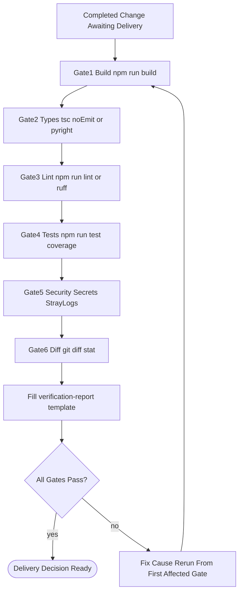
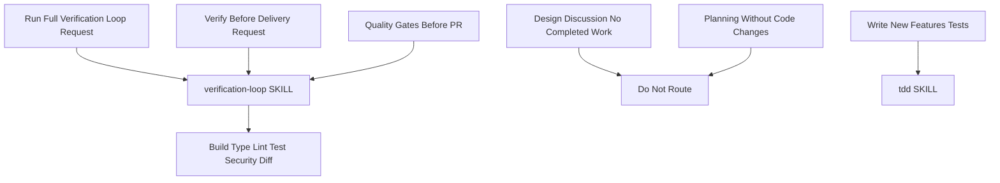
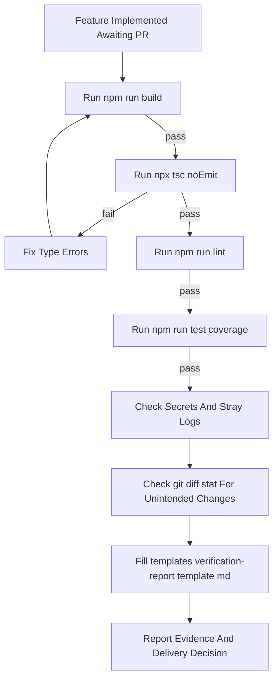

# Workflow: Verification Loop

> Run the objective gates — build, types, lint, tests, security, diff — and only claim done when the evidence-backed report passes.

Source of truth: `verification-loop/SKILL.md`.

Contract summary from SKILL.md — Trigger: completed implementation or change awaiting delivery. Output: evidence-backed verification report and delivery decision. USE FOR: verify a feature or change before delivery, run quality gates before a PR. DO NOT USE FOR: fixing failures without re-running the loop, writing new features or tests (use `tdd`).

## 1. Skill Behavior Workflow

## 2. Triggering and Routing Path

## 3. Real-World Use Case

Template: `verification-loop/templates/verification-report.template.md`. Deep dive: `verification-loop/references/verification-phases.md`.

## 4. Verification Check

- [ ] No completion was claimed until every applicable gate passed
- [ ] Build gate ran (`npm run build`) with evidence recorded
- [ ] Type gate ran (`npx tsc --noEmit` or `pyright .`) with evidence recorded
- [ ] Lint gate ran (`npm run lint` or `ruff check .`) with evidence recorded
- [ ] Test and coverage gate ran (`npm run test -- --coverage`) with evidence recorded
- [ ] Security gate checked secrets and stray logs with evidence recorded
- [ ] Diff gate checked `git diff --stat` and unintended changes with evidence recorded
- [ ] `templates/verification-report.template.md` was filled with evidence, and any failure was fixed then rerun from the first affected gate rather than patched without a rerun
