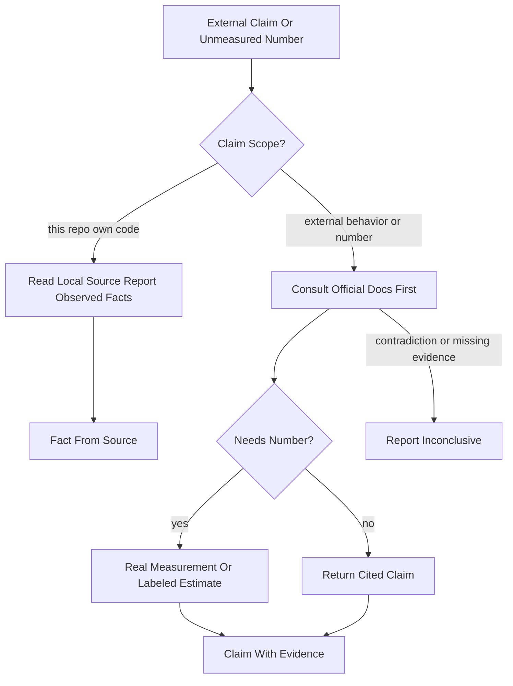
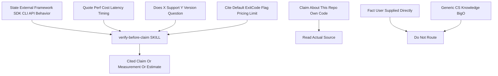
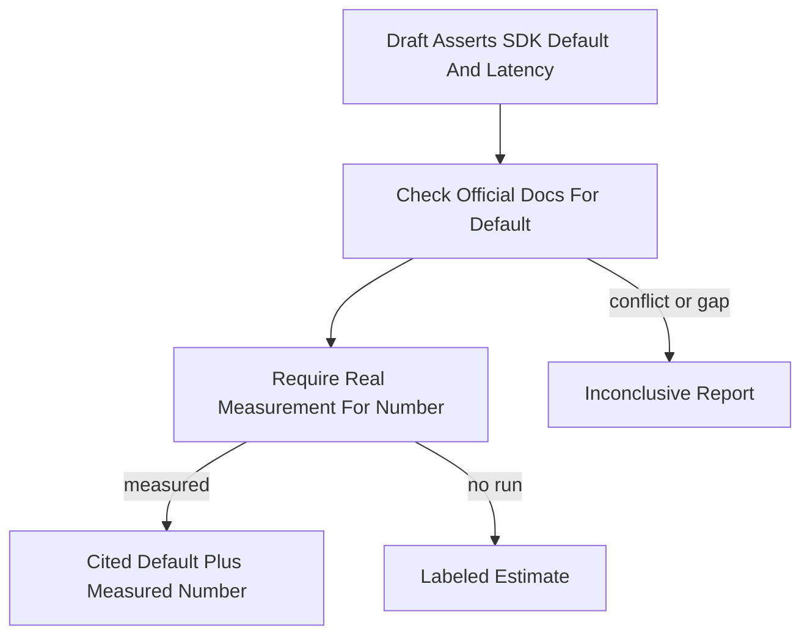

# Workflow: Verify Before Claim

> Check external framework, SDK, CLI, and API claims plus any unmeasured performance or cost numbers against an authoritative source, then deliver a cited claim, a real measurement, or a labeled estimate.

Source of truth: `verify-before-claim/SKILL.md`.

Contract summary from SKILL.md — Trigger: external behavior, version/config/exit-code claim, or unmeasured number. Output: official citation, real measurement, or explicitly labeled estimate. State mutation: none; evidence travels with the claim. Gate: official source or real measurement; unresolved claims stay inconclusive. USE FOR: stating how an external framework, SDK, CLI tool, or API behaves; quoting performance, cost, latency, or timing numbers; answering "does X support Y" or version-specific questions; citing defaults, exit codes, config flags, pricing, or rate limits. DO NOT USE FOR: claims about this repository's own code, facts the user supplied directly, generic CS knowledge such as Big-O.

## 1. Skill Behavior Workflow

## 2. Triggering and Routing Path

## 3. Real-World Use Case

A developer is about to assert a version-specific SDK default and a latency number in a design note. The skill routes the default to official documentation for a citation, routes the latency claim to a real measurement, and labels the value an estimate when no run exists. If sources contradict each other or no authoritative source exists, the result is reported as inconclusive rather than asserted as certain, even under time pressure.

Deep dive: `verify-before-claim/references/verification-guide.md`.

## 4. Verification Check

- [ ] Local-repository claims were settled by reading the actual source, not by external citation
- [ ] External framework, SDK, CLI, or API behavior used official documentation first with a citation
- [ ] Performance, cost, latency, or timing numbers came from a real measurement or were explicitly labeled as estimates
- [ ] Defaults, exit codes, config flags, pricing, and rate limits were cited rather than asserted from memory
- [ ] Contradictions or missing evidence were reported as inconclusive
- [ ] No unverified external fact was claimed as certain, even under time pressure
