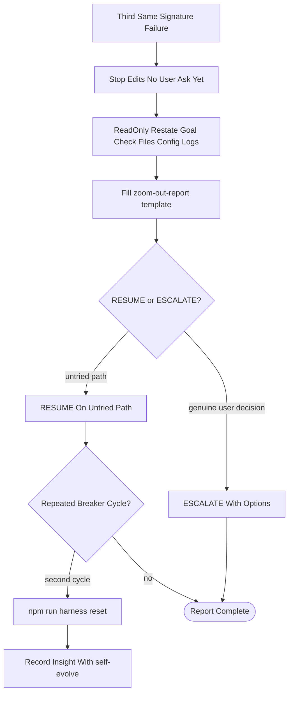
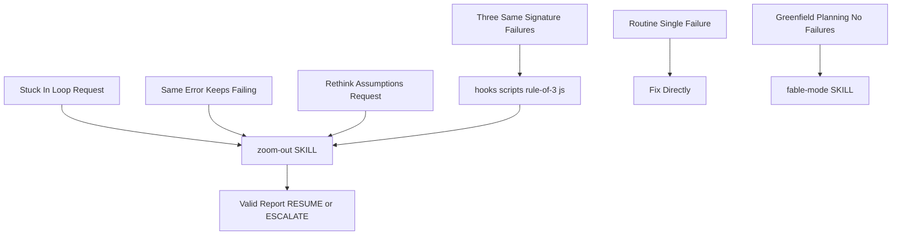
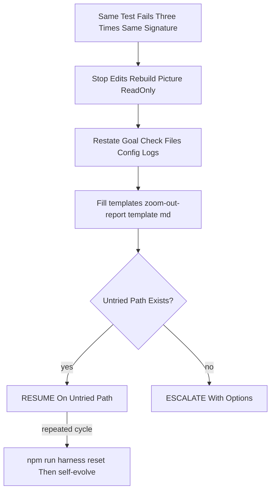

# Workflow: Zoom Out

> Reflect-first breaker after three failures: stop edits, rebuild the full picture with read-only tools, write a fact-check report, then resume or escalate.

Source of truth: `zoom-out/SKILL.md`.

Contract summary from SKILL.md — Trigger: three same-signature failures or an explicit loop/rethink request. Output: fact-checked report ending in `RESUME` or `ESCALATE`. State: writes the session `zoom-out-report.md`; reset may clear breaker state. Gate: `hooks/scripts/rule-of-3.js` plus a valid report; reset only after the second cycle. USE FOR: "you are stuck in a loop", "the same error keeps failing", "rethink your assumptions". DO NOT USE FOR: routine single-failure debugging, greenfield planning without failures.

## 1. Skill Behavior Workflow

## 2. Triggering and Routing Path

## 3. Real-World Use Case

Template: `zoom-out/templates/zoom-out-report.template.md`. Enforcement: `hooks/scripts/rule-of-3.js`. Deep dive: `zoom-out/references/circuit-breaker.md`.

## 4. Verification Check

- [ ] After three same-signature failures, edits stopped and the same approach was not retried
- [ ] Goal, files, configuration, and logs were rechecked with read-only tools before any resume
- [ ] `templates/zoom-out-report.template.md` was filled and the session `zoom-out-report.md` ends in `RESUME` or `ESCALATE`
- [ ] Resume targeted only an untried path; genuine user decisions were escalated with options
- [ ] Reset via `npm run harness:reset` happened only after the second cycle, with the insight recorded via `self-evolve`
- [ ] Routine single-failure debugging and greenfield planning without failures were not routed here
