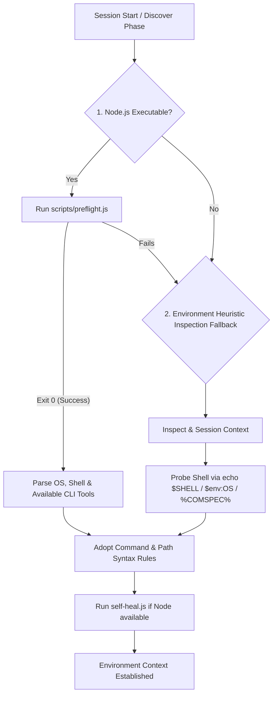

# Environment Detection — Full Shell Syntax Rules

## Decision Flow

## Cognitive loop detail

- **[Think]**: Before running any terminal commands, check your environment. Blind execution is the primary source of agent step waste.
- **[Try]**: Run the automated preflight check script to determine exact platform properties.
- **[Summarize]**: Output the detected terminal, OS, and toolchains so the session context retains these bounds.
- **[Record]**: Adopt the corresponding command syntax rules for the rest of the conversation.

## Strict Workspace Boundary detail (Current Active Workspace Only)

- **Current Workspace Only**: Must detect and operate solely within the active workspace directory (i.e. the current project root, which is `process.cwd()`).
- **Ignore Other Workspaces**: Even if VS Code context or history exposes other workspaces, temporary paths, or recently opened projects (e.g. `d:\super.h2o.sbom`, `d:\DeveloperDocs`, `c:\Users\DanielCH.Chang\Desktop\XinputDxe_V0.0.5`, etc.), you **MUST completely ignore them**. Never perform structural analysis, tool checks, or execute terminal commands in those non-current project paths.
- **Single-Workspace Execution**: All terminal commands, tool availability checks, and path resolutions MUST be strictly restricted to the current project root directory. Operating across boundaries on adjacent or unrelated folders is strictly prohibited.

## Preflight & self-heal detail

Run the preflight script that lives at `scripts/preflight.js` inside this skill's own directory — resolve the path from wherever this SKILL.md was loaded (do not guess a hard-coded location). Parse the output to understand:

- Operating System (Windows vs. macOS vs. Linux)
- Active Shell (Git Bash vs. PowerShell vs. Command Prompt)
- Available CLI Tools (node, pnpm, docker, python, etc.)

Toolchain self-heal: the harness itself is part of the environment. Audit whether this workspace's integration touchpoints (`.claude/settings.json` hooks, `.cursorrules`, `.github/copilot-instructions.md`, `AGENTS.md`) are installed, and repair any missing ones — e.g., installed via Claude Code but now opened in Copilot. The script is idempotent (it delegates to the installer, which merges hooks by id and never duplicates advisory text), so running it on an already-healthy workspace is a no-op. Skip only if the user intentionally removed a touchpoint file.

## Shell syntax rules in full

### 1. Git Bash on Windows (User's Preferred Terminal)

- **Path Slashes**: Always use forward slashes `/` (e.g., `scripts/lib/utils.js`). Never use raw backslashes `\` because they act as escape characters in Bash.
- **Env Variables**: Use `$VARIABLE_NAME` syntax. Do NOT use `%VARIABLE_NAME%` or `$env:VARIABLE_NAME`.
- **Command Set**: Standard Unix commands are fully supported (`ls`, `rm -rf`, `mkdir -p`, `cp`, `mv`). Do NOT run CMD native commands like `dir`, `del`, or `copy`.
- **No PowerShell syntax**: Do not run PowerShell-specific scripts or syntax.

### 2. PowerShell on Windows

- **Path Slashes**: Forward slashes `/` or backslashes `\\` are both acceptable.
- **Env Variables**: Use `$env:VARIABLE_NAME` syntax.
- **Command Set**: Use standard PowerShell commands or common aliases (e.g., `New-Item`, `Remove-Item`).

### 3. Windows Command Prompt (CMD)

- **Path Slashes**: Use backslashes `\` for file paths.
- **Env Variables**: Use `%VARIABLE_NAME%` syntax.
- **Command Set**: Use `dir`, `del`, `copy`, `mkdir`. Do NOT use `ls`, `rm`, `cp`, `mkdir -p`.

## Red flags & common errors

- ❌ **CMD commands in Git Bash**: Attempting to run `dir` or `del` when the terminal is actually running Git Bash.
- ❌ **PowerShell commands in Bash**: Attempting to run `$env:PATH` or `.ps1` files in a Bash environment.
- ❌ **Path escape failures**: Sending raw Windows paths like `scripts\run.js` inside a Bash terminal, which interprets `\r` as a carriage return or escapes characters.

## Verification & reflection

If any shell command fails, do not blindly retry the exact same command. Stop and ask yourself: "Did I use the wrong syntax for this terminal? Is this a Git Bash vs. PowerShell syntax issue?" If you fail 3 times on the same command, trigger the `zoom-out` circuit breaker.
