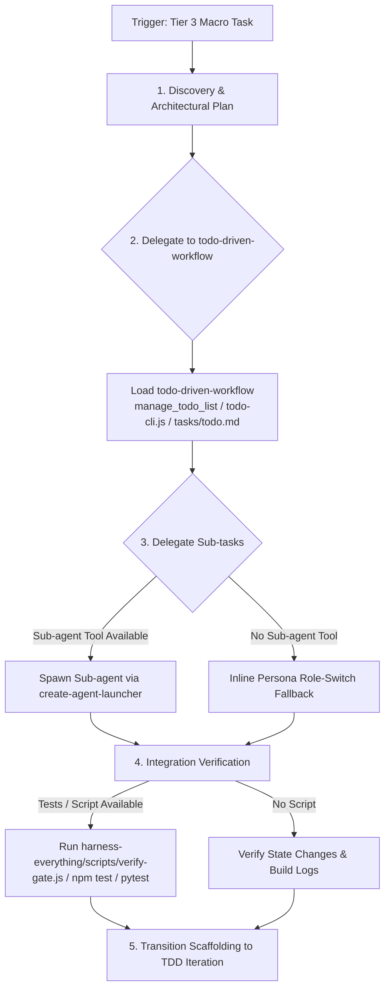

# Fable Mode (Macro Task Planning & Execution Engine)

## 📋 Skill Contract

| Component | Specification |
| :--- | :--- |
| **Trigger / Input** | Tier 3 Task classification. Input: Multi-domain requirement or major architectural scaffolding. |
| **Expected Output** | 1. Architectural breakdown. 2. Milestone TODO tracking via `todo-driven-workflow`. 3. Sub-agent handoffs or inline persona delegation. 4. Integration verification. |
| **State Mutations** | Initializes TODO checklist via `todo-driven-workflow` (`manage_todo_list`, `todo-cli.js`, or `tasks/todo.md`). |
| **Enforcement Gate** | Milestone state tracking via `todo-driven-workflow`. Run integration verification (`harness-everything/scripts/verify-gate.js` or project test suite) at major integration boundaries. |

## Process & Macro Execution Flow

Follow the decision matrix below when executing Tier 3 macro tasks:

Fable Mode structures complex, multi-domain Tier 3 tasks through architectural planning and specialized division of labor.

## Core Approach: Plan Before Execution

Act as an Architect and Technical Coordinator, combining Fable Mode with `fable-discipline` to maintain scope boundaries.

## Sub-Skills
- `execution-guardrails/` — always-on operational rules (verify-before-flag, warning thresholding, context-anchored substring edits).
- `fable-haiku/` — opt-in variant that routes mechanical worker steps to a lightweight Haiku agent.
- `agents/fable-orchestrator` — opt-in variant for large, multi-part, or multi-session tasks needing enforced delegation: it has no Write/Edit tool of its own, so every artifact must come from `fable-worker-sonnet`/`fable-worker-haiku` behind a failable per-stage check (`CONTRACT-FORMAT.md`), with high-stakes output cold-reviewed by `fable-verifier` before delivery. Spawn it via the Task tool (`subagent_type: "fable-orchestrator"`) in place of running the phases below directly when the task is too large or too session-spanning to trust continuous self-supervision.

## Execution Phases

### 1. Discovery & Planning
- **Assess System State**: Review relevant files, interfaces, and dependencies.
- **Deconstruct Task**: Break large requirements into bounded, verifiable sub-tasks.
- **Formulate Plan**: Draft a clear implementation outline and align with the user.
- **Track Progress**: Load and execute `todo-driven-workflow` to initialize the milestone roadmap and manage step-by-step state across phases.

### 2. Sub-agent Delegation
- When tasks span distinct technical boundaries (e.g. database migration vs frontend component), delegate specialized sub-tasks using `create-agent-launcher`.
- Provide sub-agents with clear, bounded briefs and domain file paths.

### 3. Monitoring & Integration
- Track progress as sub-agents complete their briefs.
- **Scope Verification**: Review sub-agent output against `hooks/scripts/subagent-scope-guard.js` alerts to ensure changes remained within briefed boundaries.
- Run integration tests at each milestone boundary before proceeding.

### 4. Transitioning
- Once macro scaffolding is complete and remaining work scales down to standard feature implementation, transition to `tdd` mode for focused iteration.
