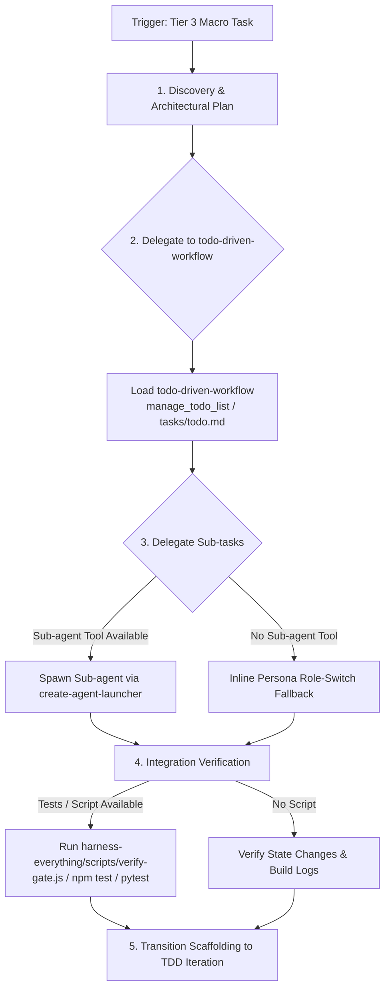

# Fable Mode — Execution Phases (Full Detail)

## Process & Macro Execution Flow

Follow the decision matrix below when executing Tier 3 macro tasks:

Fable Mode structures complex, multi-domain Tier 3 tasks through architectural planning and specialized division of labor.

## Core Approach: Plan Before Execution

Act as an Architect and Technical Coordinator, combining Fable Mode with `fable-discipline` to maintain scope boundaries.

## Execution Phases

### 1. Discovery & Planning
- **Assess System State**: Review relevant files, interfaces, and dependencies.
- **Deconstruct Task**: Break large requirements into bounded, verifiable sub-tasks.
- **Scope Lock (Zero-Trust Boundaries)**: Before writing any code or delegating tasks, you MUST explicitly define the authorized file modification scope (e.g., "Allowed to edit `src/billing/**`"). This scope must be documented in the state file or chat. Any sub-agent or execution step that attempts to modify files outside this explicit boundary is a violation and must be blocked.
- **Formulate Plan**: Draft a clear implementation outline and align with the user.
- **Track Progress**: Load and execute `todo-driven-workflow` to initialize the milestone roadmap and manage step-by-step state across phases.

### 2. Sub-agent Delegation
- When tasks span distinct technical boundaries (e.g. database migration vs frontend component), delegate specialized sub-tasks using `create-agent-launcher`.
- Provide sub-agents with clear, bounded briefs and domain file paths.

### 3. Monitoring & Integration
- Track progress as sub-agents complete their briefs.
- **Scope Verification**: Review sub-agent output against `hooks/scripts/subagent-scope-guard.js` alerts to ensure changes remained within briefed boundaries.
- Run integration tests at each milestone boundary before proceeding.

### 4. Verification Gate: Pre-Delivery Code Audit (Fan-out/Merge)
- Before declaring a macro task (Tier 3) complete, you MUST initiate a parallel code audit.
- **Fan-out**: Use `create-agent-launcher` to simultaneously launch independent Sub-agents (e.g., QA, Security, Performance) to review the Git Diff of the completed work.
- **Merge**: Wait for these reports. If any `Blocker` level issue is found, regress to the implementation phase to fix it. If all pass, proceed to finalize.

### 5. Transitioning
- Once macro scaffolding is complete and remaining work scales down to standard feature implementation, transition to `tdd` mode for focused iteration.
