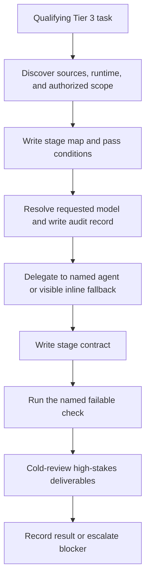

# Fable Mode — Execution Phases

## Discovery and planning

Read the relevant files and sources before producing an artifact. Lock the
authorized write scope in the handoff. Number the stages, assign one artifact
and one pass condition to each, and allow no more than two full replans.

## Delegation

Use `fable-orchestrator` for Opus macro work, `fable-worker-sonnet` for
reasoning and synthesis, and `fable-worker-haiku` for mechanical work. Brief
each worker with its exact output path, context, audit record, and check.
Workers do not spawn workers. If the named agent is unavailable, choose the
explicit inline fallback or stop and escalate; do not silently change models.

## Verification and handoff

Before each spot-check, create `.claude/harness-state/contracts/<stage>.json`
using `CONTRACT-FORMAT.md`, then run the exact command in that contract. A
stage is not complete until the command passes and the audit record contains
the verifier result. Use `fable-verifier` with only the spec and artifact for
high-stakes or unsupervised delivery. Review scope-guard output before merging.

When macro scaffolding ends, transition to `tdd` for focused implementation.
