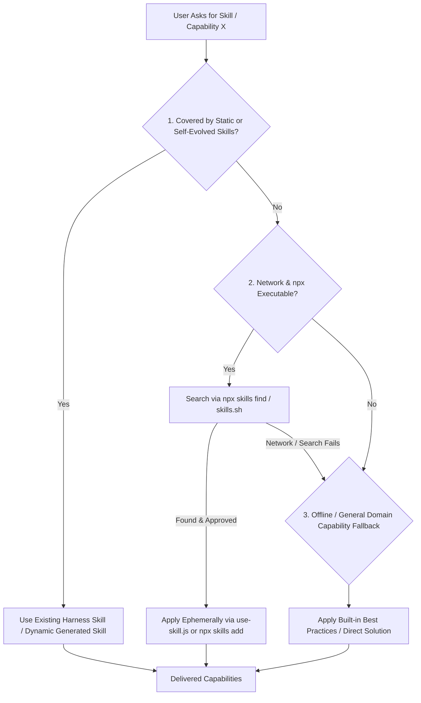

# Find Skills (External Skill Discovery)

## 📋 Skill Contract

| Component | Specification |
| :--- | :--- |
| **Trigger / Input** | Explicit request to search for an external skill ("find skill for X"). |
| **Expected Output** | Pointer to existing static/self-evolved skill, or external skill applied via `use-skill.js`/`npx skills add`, or direct domain capability fallback. |
| **State Mutations** | Ephemeral temp cache (`use-skill.js`) or native platform skill folder (`npx skills add` if user opts in). |
| **Enforcement Gate** | Check static/self-evolved skills first. MUST get explicit user confirmation before applying third-party skill code. Handle network/npx failure gracefully. |

## Process & Search Resolution Flow

Follow the decision matrix below when discovering skills:



## 0. Check existing coverage first (don't search externally if you don't have to)

Confirm the capability doesn't already exist, in this order:

1. **Static skills** — grep `harness-everything/SKILL.md` §5's registry table for a matching row. This is the reviewed, first-party skill set; `tier-router.js` also surfaces it automatically by keyword.
2. **Self-evolved dynamic skills** (`generated[]`) — skills this workspace's own agent authored via `self-evolve` after a hard-won lesson. `tier-router.js` scans every reachable `manifest.json`'s `generated[]` array every turn and prints a `🎯 HIGH-RELEVANCE SELF-EVOLVED SKILL DETECTED` block when a skill's `triggers` match — check this turn's routing checkpoint output before doing anything else.
3. **Third-party skills someone already chose to keep** — query live, don't guess:
   ```bash
   npx skills list --json          # project scope
   npx skills list -g --json       # global scope
   ```
   This only ever finds something if a past session went through the rare §6b exception path — the default §6 path (below) never shows up here, by design, because it never installs anything. Checked live rather than cached on purpose: unlike `generated[]` (which Harness fully owns — authored, quality-gated by `skill-creator`, lifecycle-tracked draft/active/deprecated), a third-party skill's content can change out from under a cache the moment its author updates it or the user runs `npx skills update`/`remove` — Harness has no way to govern that lifecycle, so it doesn't pretend to by caching a snapshot. `npx skills list` is already the CLI's own live, authoritative record. (Full reasoning: `docs/reflection.md`'s "External Skills" section.)

Only proceed to §1 if none of the three cover the request.

## 1. Understand what they need

Identify: the domain (React, testing, deployment, design...), the specific task, and whether it's common enough that a published skill likely exists.

## 2. Check the leaderboard first

Before running a CLI search, check the [skills.sh leaderboard](https://skills.sh/) for a well-known skill in the domain. Top sources: `vercel-labs/agent-skills` (React, Next.js, web design), `anthropics/skills` (frontend design, document processing).

## 3. Search for skills

```bash
npx skills find [query] [--owner <owner>]
```

Examples: `npx skills find react performance`, `npx skills find pr review`, `npx skills find changelog`.

## 4. Verify quality before recommending

Don't recommend a skill from search results alone. Check:
- **Install count** — prefer 1K+ installs; be cautious under 100.
- **Source reputation** — official sources (`vercel-labs`, `anthropics`, `microsoft`) outrank unknown authors.
- **GitHub stars** — treat a source repo with <100 stars with skepticism.
- **Trust, not just quality** — a third-party `SKILL.md` is natural-language instructions that get loaded into agent context and followed, whether applied ephemerally or installed permanently. Unlike this repo's own skills (which pass `skill-creator`'s Quality Checklist and get reviewed via PR), it's unaudited. Read the actual `SKILL.md` content before applying it, the same way you'd review a dependency before adding it — not just its install count.

## 5. Present options, then get explicit approval

Show the skill name, what it does, install count/source, and ask whether this is a one-off or something worth keeping — that answer decides §6 vs §6b. Never fetch or apply anything from §3's search results without this confirmation.

```
I found a skill that might help! The "react-best-practices" skill provides
React and Next.js performance optimization guidelines from Vercel Engineering.
(185K installs)

Source: vercel-labs/agent-skills@react-best-practices
Learn more: https://skills.sh/vercel-labs/agent-skills/react-best-practices

Want me to apply it to this task? (It won't be installed anywhere unless you
tell me you'll want it again later.)
```

## 6. Apply (default path — ephemeral, cached, zero footprint)

Run this skill's own small wrapper instead of raw `npx skills use`:

```bash
node "<this-skill-dir>/scripts/use-skill.js" <owner/repo[@skill]>
```

It prints the skill's `SKILL.md` wrapped as a ready-to-follow prompt (identical to `npx skills use`'s own stdout format) — read that output and apply it to the current task. Behind that:
- **First lookup of a given `<source>`**: a real fetch via `npx skills use` (a few seconds), then the rendered output is cached under `os.tmpdir()/harness-find-skills-cache/<sha1-of-source>.md`.
- **Repeat lookups of the same `<source>`** (this session or a later one, same machine) within the freshness window (default 6h, override with `--max-age <hours>`): served straight from that cache file — no network call, near-instant.
- **Nothing is written to the repo, to any platform's native skill directory, or to `manifest.json`.** The cache lives entirely under the OS temp directory, so it needs no explicit cleanup and nothing for Harness to track — the OS reclaiming temp files on its own schedule is the only "expiry" this needs, and a reclaimed-or-past-freshness-window entry is just treated as a fresh cache miss.

This is the default for a reason: a skill applied through here costs real work on first fetch and effectively nothing on repeats, without ever growing a footprint that later sessions have to read through or a human has to remember to clean up.

## 6b. Install permanently (only when the user explicitly wants to keep it)

Only when the user says this is something they expect to reuse across many future sessions — not the default, and not implied by "yes, use it":

```bash
npx skills add <owner/repo[@skill]> --agent <agent> [-g] -y
```

Map whichever platform this session is actually running in to the CLI's own agent name: `claude` → `claude-code`, `cursor` → `cursor`, `copilot` → `github-copilot`, `codex` → `codex`, `continue` → `continue`. `-g` targets that platform's global skill directory instead of the project-local one — same local-vs-global convention `scripts/installer.js` uses. Nothing further to register: §0.3's live `npx skills list` finds it again next time.

## 7. If truly no skill exists

Acknowledge it, offer to help directly with general capabilities, and suggest `npx skills init <name>` if this is a recurring need worth publishing.

## Related skills

- `self-evolve/SKILL.md` + `skill-creator/SKILL.md` §4 — the Dynamic Skill Generation Contract for `generated[]` skills. Deliberately a *different* mechanism from this skill, not a shared one: `generated[]` skills are self-authored and lifecycle-owned by Harness, so caching their triggers in `manifest.json` for `tier-router.js` to match is safe. Third-party skills fetched here default to a self-expiring OS-temp cache with no Harness bookkeeping at all (§6), or, in the rare §6b case, the CLI's own native install + lock file — never a second, driftable Harness-owned cache.
- `harness-everything/SKILL.md` §5 — the static skill registry to check in §0 before searching externally.
