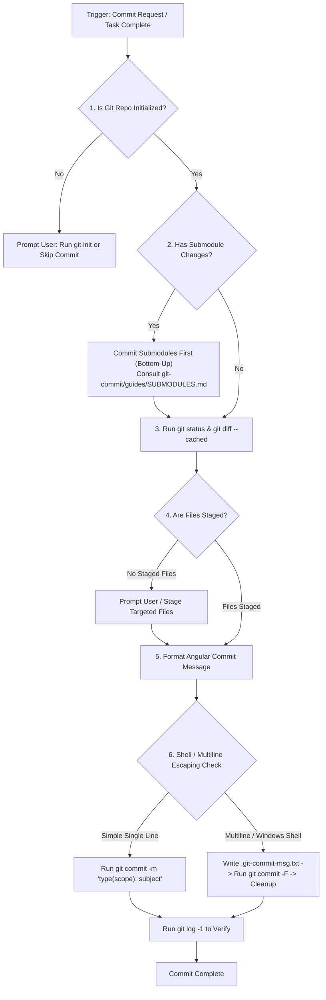

# Git Commit (Angular Style)

## 📋 Skill Contract

| Component | Specification |
| :--- | :--- |
| **Trigger / Input** | User explicitly requests a commit, or a task phase concludes. Input: Staged git diff. |
| **Expected Output** | Clean Angular-style commit created via `git commit -m` or temporary message file (`git commit -F`). |
| **State Mutations** | Git tree is updated. Workspace working tree becomes clean. |
| **Enforcement Gate** | Run `git status` first. If no files staged, prompt user before staging. On non-git repo, offer `git init` or skip. |

## Process & Commit Execution Flow

Follow the decision matrix below when committing changes:

## 1. Quick Workflow

1. **Verify State**: Run `git status` to inspect staged changes. If working inside submodules, handle submodule commits first by consulting `git-commit/guides/SUBMODULES.md`.
2. **Review Diff**: Run `git diff --cached` to understand the exact scope of changes.
3. **Format Message**: Follow the Angular commit convention (`<type>(<scope>): <subject>`). For detailed formatting rules, see `git-commit/guides/ANGULAR_STYLE.md`.
4. **Execute Commit**: Run `git commit -m "..."`.

## 2. Deep Reference Guides (Progressive Disclosure)
Load specific guides only when needed for complex commit scenarios:
- `git-commit/guides/ANGULAR_STYLE.md` — Conventional commit structure, types, and scope rules
- `git-commit/guides/COMMIT_GENERATION.md` — Message generation patterns and diff analysis tips
- `git-commit/guides/LANGUAGE_DETECTION.md` — Natural language conventions for commit subjects
- `git-commit/guides/MAIN_REPO.md` — Guidelines for monorepos and main repository commits
- `git-commit/guides/SUBMODULES.md` — Step-by-step handling for submodules and nested repos
