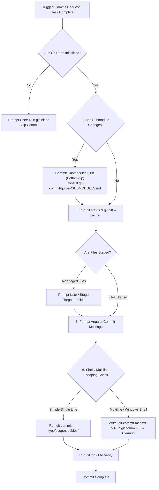

# Git Commit — Decision Matrix

Details moved from SKILL.md. Read when you need the full commit execution flow.

## Process & Commit Execution Flow

```mermaid
flowchart TD
    Start[Trigger: Commit Request / Task Complete] --> CheckGit{1. Is Git Repo Initialized?}
    
    CheckGit -- No --> OfferInit[Prompt User: Run git init or Skip Commit]
    CheckGit -- Yes --> CheckSubmodules{2. Has Submodule Changes?}
    
    CheckSubmodules -- Yes --> CommitSubmodules["Commit Submodules First (Bottom-Up)<br>Consult git-commit/guides/SUBMODULES.md"] --> CheckStatus
    CheckSubmodules -- No --> CheckStatus[3. Run git status & git diff --cached]
    
    CheckStatus --> StagedCheck{4. Are Files Staged?}
    
    StagedCheck -- No Staged Files --> AskStage[Prompt User / Stage Targeted Files] --> Format
    StagedCheck -- Files Staged --> Format[5. Format Angular Commit Message]
    
    Format --> CheckShell{6. Shell / Multiline Escaping Check}
    
    CheckShell -- Simple Single Line --> DirectCommit["Run git commit -m 'type(scope): subject'"]
    CheckShell -- Multiline / Windows Shell --> TempFileCommit[Write .git-commit-msg.txt -> Run git commit -F -> Cleanup]
    
    DirectCommit --> VerifyCommit[Run git log -1 to Verify]
    TempFileCommit --> VerifyCommit
    VerifyCommit --> Done[Commit Complete]
```
