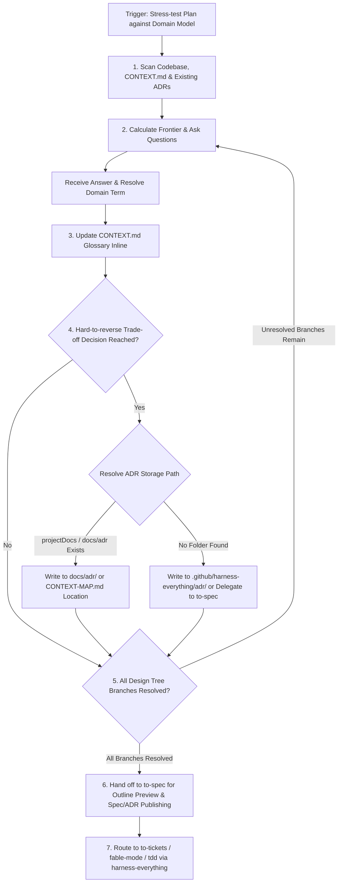

# Grill With Docs — Full Session Playbook

## Decision Flow



## Core interview prompt

Interview me relentlessly about every aspect of this plan until we reach a shared understanding. Walk down each branch of the design tree, resolving dependencies between decisions one-by-one. For each question, provide your recommended answer.

Ask the questions one at a time, waiting for feedback on each question before continuing.

If a question can be answered by exploring the codebase, explore the codebase instead.

## Dynamic storage resolution & file structure

Inspect the workspace and resolve document locations dynamically:

1. **Monorepo / Multi-Context**: If `CONTEXT-MAP.md` exists at the root, follow its context-specific mapping.
2. **Project Configured / Inferred Location**: Run `node "to-spec/scripts/check-project-docs.js" check` or inspect if `docs/adr/` or `docs/` exists in the workspace.
3. **Platform Fallback**: If no documentation directory exists, write ADRs under `.github/harness-everything/adr/` (or `.claude/harness-everything/adr/`, `.cursor/harness-everything/adr/`), or delegate formal document generation to `to-spec`.

```
/
├── CONTEXT.md                        ← Primary domain glossary
├── docs/                             ← Default documentation root
│   └── adr/                          ← System-wide ADR decisions
│       ├── 0001-event-sourced-orders.md
│       └── 0002-postgres-for-write-model.md
└── .github/harness-everything/adr/   ← Fallback ADR storage if workspace has no docs/ directory
```

Create files lazily — only when you have resolved terms or ADRs to write.

## Session techniques in full

### Challenge against the glossary

When the user uses a term that conflicts with the existing language in `CONTEXT.md`, call it out immediately. "Your glossary defines 'cancellation' as X, but you seem to mean Y — which is it?"

### Sharpen fuzzy language

When the user uses vague or overloaded terms, propose a precise canonical term. "You're saying 'account' — do you mean the Customer or the User? Those are different things."

### Discuss concrete scenarios

When domain relationships are being discussed, stress-test them with specific scenarios. Invent scenarios that probe edge cases and force the user to be precise about the boundaries between concepts.

### Cross-reference with code

When the user states how something works, check whether the code agrees. If you find a contradiction, surface it: "Your code cancels entire Orders, but you just said partial cancellation is possible — which is right?"

### Update CONTEXT.md inline

When a term is resolved, update `CONTEXT.md` right there. Don't batch these up — capture them as they happen. Use the format in [CONTEXT-FORMAT.md](../CONTEXT-FORMAT.md).

`CONTEXT.md` should be totally devoid of implementation details. Do not treat `CONTEXT.md` as a spec, a scratch pad, or a repository for implementation decisions. It is a glossary and nothing else.

### Offer ADRs sparingly

Only offer to create an ADR when all three are true:

1. **Hard to reverse** — the cost of changing your mind later is meaningful
2. **Surprising without context** — a future reader will wonder "why did they do it this way?"
3. **The result of a real trade-off** — there were genuine alternatives and you picked one for specific reasons

If any of the three is missing, skip the ADR. Use the format in [ADR-FORMAT.md](../ADR-FORMAT.md).

## Handoffs in full

1. **Pre-flight**: If the core proposal is highly vague or its technical robustness (SRE, security, locks, concurrency, fail-safes) is unverified, recommend the user run `grill-me` first. Do not attempt to align a glossary for a broken or unstable design.
2. **Transition**: Once technical issues are hardened in `grill-me`, transition here to solidify domain terms and record architectural choices.
3. **Downstream Specification Handoff**: Once alignment is complete and domain terms are updated, hand off to `to-spec/SKILL.md` to present an outline preview and publish the formal specification document or ADR.
4. **Execution Handoff**: Route to `to-tickets` (for ticket decomposition), `fable-mode` (for macro scaffolding), or `tdd` (for feature implementation) via `harness-everything`.
