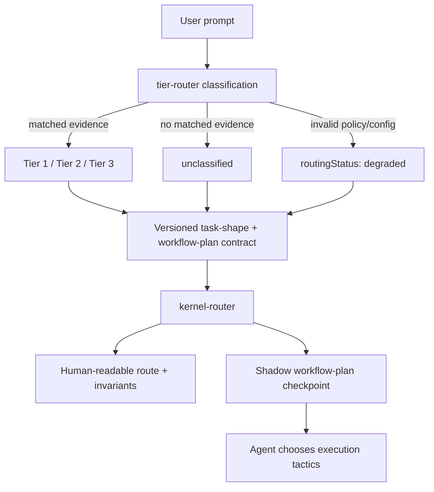

# Router Workflow Plan Contract

Issue #85 separates three decisions that were previously conflated:

```text
Tier / risk classification
        + execution topology
        + optional capabilities
```

Phase 1 introduces a versioned structured contract while leaving strategy selection in shadow mode. The router is a planner: it emits a plan but does not execute tools, spawn agents, create workspaces, write memory, or retry failed execution.

## Phase 1 flow



`unclassified` is not a synonym for Tier 1. Missing evidence remains visible and must not be silently downgraded to trivial work.

## Structured transport

`tier-router.js` keeps its human-readable output for compatibility and writes the machine-readable contract to a per-invocation side-channel path supplied by `kernel-router.js`. The kernel validates that contract and never scrapes the human-readable `RECOMMENDED TIER` text to decide behavior.

If the structured contract is missing or invalid, the kernel creates a visible degraded/unclassified result rather than defaulting to Tier 1.

## Task-shape schema

The Phase 1 task shape records only observed or explicitly known values. Inputs that are not yet measured stay `unknown` / `null`; the router must not turn estimates into facts.

Key groups:

- scope and current classifier signals;
- dependency/write-set/domain/duration placeholders for later deterministic selection;
- reversibility, uncertainty, and verification requirement;
- host capability placeholders;
- user budget/latency/token/concurrency constraints;
- explicit Fable model request when present;
- deterministic reason codes.

## Workflow-plan schema

Phase 1 emits the final-shaped contract but deliberately leaves `strategy: null` with `strategySelection: shadow`.

The contract already carries:

- `routingStatus` and `tier`, including `unclassified`;
- required invariants;
- `actionGate` field (not yet selected/enforced in Phase 1);
- loop/revision/worker limits;
- parallelism/workspace/memory/verification placeholders;
- explicit model request with model selection delegated to Fable;
- visible fallback policy;
- deterministic reason codes.

Phase 2 will select among the approved strategy vocabulary:

- `direct-single`
- `iterative-single`
- `fable-staged`
- `fable-parallel`
- `fable-multi-agent-workspace`

`ensemble-review`, memory, tool use, and `actionGate` remain modifiers/capabilities rather than independent mandatory workflows.

## Determinism rule

The structured contract contains no timestamp, random plan identifier, temporary path, or runtime-only noise. The same normalized task inputs and capability/config state must serialize to byte-equivalent JSON.
