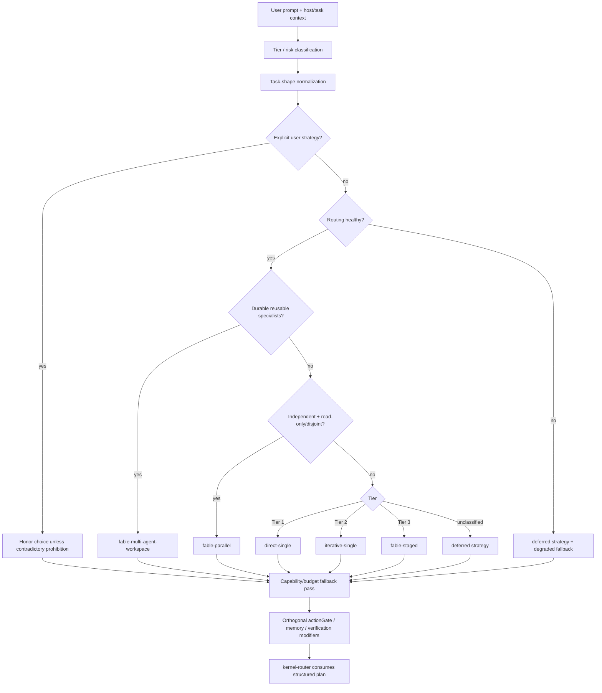

# Router Workflow Plan Contract

Issue #85 separates three decisions that were previously conflated:

```text
Tier / risk classification
        + execution topology
        + optional capabilities
```

The router is a planner. It emits a versioned, deterministic plan but does not execute tools, spawn agents, create workspaces, write memory, enforce approvals, or retry failed execution.

## Phase 2 flow



`unclassified` is not a synonym for Tier 1 or `direct-single`. Missing classification evidence leaves strategy selection deferred, while independent risk signals such as `actionGate` are still evaluated.

## Structured transport

`tier-router.js` keeps human-readable output for compatibility and writes the machine-readable contract to a per-invocation side-channel path supplied by `kernel-router.js`. The kernel validates and consumes that contract; it does not scrape tier or strategy from text.

If the structured contract is missing or invalid, the kernel emits a degraded/unclassified contract rather than silently choosing Tier 1/direct execution.

## Deterministic strategy vocabulary

| Strategy | Selection rule | Key invariants |
|---|---|---|
| `direct-single` | Tier 1 bounded/trivial task | scope lock, verify before claim |
| `iterative-single` | Tier 2 ordinary diagnosis/TDD/tool loop | objective verification, advisory iteration guidance |
| `fable-staged` | Tier 3 dependent work or parallel independence not proven | stage contracts, cold verifier |
| `fable-parallel` | Tier 3 with explicit independent workstreams and read-only/disjoint write scope | stage contracts, parallel scope contract, synthesis barrier |
| `fable-multi-agent-workspace` | durable multi-session task needing reusable specialists | workspace state, handoffs, stage contracts, cold verifier |

Tier 3 alone never implies a persistent workspace. Likewise, an `independent` label alone is insufficient for `fable-parallel`: the write set must also be `read-only` or `disjoint`.

The Phase 2 `iterative-single` plan exposes **8 iterations** as advisory planning guidance, not a machine-enforced stop. Continue when evidence justifies it; the separate rule-of-3 repeated-failure reflection gate remains the hard boundary.

## Explicit user choice and prohibitions

The task-shape contract records:

- an explicit requested strategy, when named;
- an explicit Fable model request, still delegated to `fable-mode/scripts/model-selector.js`;
- prohibitions such as no Fable, no subagents, no parallel execution, or no workspace.

Explicit choices override derived topology. Contradictory choice + prohibition is visible as a blocked fallback rather than silently guessing which instruction to ignore.

## Host capability and budget fallbacks

Host capabilities can be supplied in hook context (`hostCapabilities`) or deterministic environment inputs. Unknown capability remains `unknown`; only known unavailability causes fallback.

Examples:

- missing parallel calls or `concurrency: 1` serializes `fable-parallel` to `fable-staged` with a `reduced/serialized` fallback;
- unavailable subagents may reduce staged execution to visible inline execution;
- missing durable state for a required multi-agent workspace is `blocked`, not silently downgraded;
- a requested Fable model with known unavailable model capability is `blocked`; the router never substitutes another branded model;
- a required `actionGate` with known unavailable hook capability is `blocked`.

Fallbacks carry deterministic reason codes.

## `actionGate` is orthogonal to strategy

Irreversible or external side-effect intent (for example destructive database changes, force push, production deploy, publish, payment, or external send) adds:

```json
{
  "actionGate": {
    "required": true,
    "reasonCodes": ["irreversible-action"],
    "approver": "rule-or-human",
    "disposition": "pending-approval"
  }
}
```

This does not choose a topology and does not itself enforce the gate. Phase 5 owns PreToolUse enforcement. The router only declares the invariant so any eventual executor must preserve it.

## Invariants vs advisory skills

`requiredInvariants` and `suggestedSkills` are separate plan fields. The kernel prints both separately and consumes them from the structured plan instead of reconstructing suggestions from tier.

Examples:

- `objective-verification` and `loop-budget` are mandatory for `iterative-single`;
- `tdd` and `verification-loop` remain advisory skill suggestions;
- `stage-contracts` and `cold-verification` are mandatory for Fable topologies;
- `multi-agent-workspace` is suggested only when the selected topology actually requires durable workspace behavior.

There is no universal `TODO → TDD → verification` pipeline.

## Guide deduplication

Knowledge-guide recommendations are deduplicated by the referenced guide path, not by full line text. If two routing groups describe `security-review/SKILL.md` differently, the path is still emitted once.

## Determinism rule

The structured contract contains no timestamp, random plan identifier, temporary path, or runtime-only noise. The same normalized task inputs plus the same host capability/config state serialize to byte-equivalent JSON.

Derived estimates remain visibly derived fields. Unknown host/task facts remain `unknown`; the router must not invent capability or state evidence.
