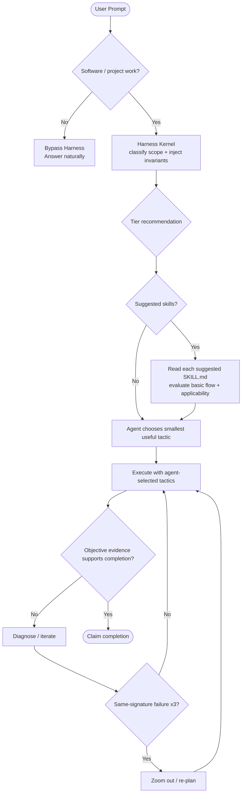
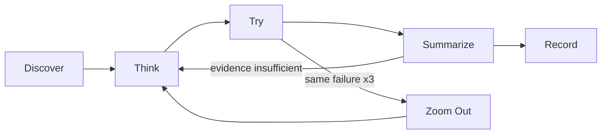

# Task Triage & Tier Details

Harness uses tiers to estimate scope and surface useful capabilities. A tier is **not** a fixed pipeline. The runtime enforces a small set of cross-cutting invariants plus mandatory evaluation of router-suggested skills; execution choice, ordering, and delegation remain with the agent after that evaluation.

> Architecture rule: **Do not enforce workflow order. Enforce workflow invariants and evaluate suggestions before skipping them.**

## 0. When Harness Routing Applies



### Bypass Rules

- **Pure chat, translation, general web search, non-software writing:** bypass Harness routing.
- **Software engineering / codebase / project work:** establish the Harness Kernel contract before mutating work, even when the prompt already names a domain skill such as `tdd`, `security-review`, or `repo-docs`.

A host may auto-select a peer/domain skill. That selection must not be treated as proof that Harness routing already happened.

## 1. The Minimal Harness Kernel

The kernel exists to keep strong models free while protecting the few behaviors that should not disappear under autonomous skill selection.

### Mandatory invariants

1. **Route before execution** — establish task scope/tier before mutating software work.
2. **Verify before claim** — completion claims require objective evidence appropriate to the change.
3. **Re-plan on repetition** — after three same-signature failures, stop micro-retrying and use a fresh diagnosis / `zoom-out`.
4. **Evaluate before skip** — when the router suggests a skill, read that skill's complete `SKILL.md` entry/basic flow before omitting it.

The fourth invariant is conditional: it applies when the router emits one or more suggestions. It makes **evaluation mandatory, not execution**.

### What is intentionally *not* mandatory

- Executing `todo-driven-workflow` for every Tier 2/3 task after its applicability has been evaluated.
- Running TDD where the `tdd` flow has been read and executable behavioral tests do not add value.
- Entering Fable/multi-agent mode merely because the task is Tier 3 after those suggested flows have been evaluated.
- Following a universal `TODO → TDD → verification-loop` or `Fable → subagent → verification-loop` sequence.
- Loading `install-cognitive-os` as a peer skill before every other skill.
- Reading every optional deep-dive/reference linked by a suggested skill. Only material the skill entry explicitly requires to decide applicability joins the mandatory evaluation set.

`install-cognitive-os` remains the human-readable/manual entry point for the cognitive policy. Supported runtime integrations should establish the kernel invariants without depending on that skill being selected first.

## 2. Routing Mechanism

Use the public kernel entry point:

```bash
node "<this-skill-dir>/scripts/kernel-router.js" "<brief prompt summary>"
```

or:

```bash
npx github:dyphn1/Harness-everything next "<brief prompt summary>"
```

`kernel-router.js` delegates classification and guide discovery to `tier-router.js`, removes legacy fixed-pipeline instructions, and emits:

- the recommended tier and rationale,
- a compact **Harness Routing Checkpoint**,
- the **required Harness invariants**,
- suggested skills under a **mandatory evaluation / advisory execution** contract,
- the policy that the agent may choose the smallest useful skill/tool set after evaluating suggestions.

If a host's `UserPromptSubmit` integration already ran the kernel this turn, reuse that output rather than running it twice. The checkpoint must still become user-visible for software/project work: use the host's visible hook rendering when it has one, otherwise include the checkpoint in the first progress/update message.

The tier classifier is heuristic. Treat its result as the default route, not an oracle. A clear task reading or explicit user instruction may override it; record the reason when doing so.

### Suggestion evaluation contract

For every router-suggested skill:

1. Resolve and read the complete `SKILL.md` entry.
2. Evaluate `USE FOR`, `DO NOT USE FOR`, its workflow/basic flow, and any hard rules in the entry against the current task.
3. If the entry explicitly requires another document to determine applicability, read that required material too. Ordinary deep-dive/reference links remain optional unless the entry makes them decision-critical.
4. Only then choose `use`, `skip`, or `unresolved/unavailable`.

A skill must not be skipped from only its name, frontmatter description, router summary, or a generic judgement such as “routine/common task.” Using one suggested skill does not waive evaluation of the other suggestions before they are skipped. A suggestion that cannot be resolved/read is not a valid skip; mark it `unresolved/unavailable`.

## 3. Tier Guidance

### Tier 1 — Trivial

Typical shape:
- typo/small documentation correction,
- simple local code edit,
- narrow explanation,
- straightforward Git operation.

Default behavior:
- prefer direct execution,
- avoid large plans and unnecessary delegation,
- when the router emits no suggestions, proceed with the bounded direct path,
- when it does emit a focused suggestion, evaluate that skill entry before omitting it,
- still verify any completion claim with evidence appropriate to the change.

### Tier 2 — Standard

Typical shape:
- a specific feature or bug fix,
- multi-file coordination,
- behavioral changes needing tests,
- focused benchmark/review work.

Common **suggestions**, not a pipeline:

| Need observed in the task | Useful skill |
|---|---|
| Several verifiable steps need explicit tracking | `todo-driven-workflow` |
| Behavior can be specified by executable tests | `tdd` |
| Delivery needs systematic build/lint/test/diff evidence | `verification-loop` |
| Auth/input/secrets/network boundaries are touched | `security-review` |
| Isolated workspace would reduce risk | `using-git-worktrees` |
| Quantitative scoring/benchmarking is requested | `eval-harness` |

Every emitted suggestion is mandatory to **evaluate** by reading its skill entry/basic flow. After that, the model decides which skills are useful and in what order; it may execute none, one, or several while preserving the kernel invariants. Adopting one suggestion does not permit the others to be skipped without evaluation. If every suggestion is skipped after evaluation, the visible checkpoint/progress update must include one brief reason grounded in the evaluated flow mismatch.

### Tier 3 — Macro

Typical shape:
- repository-wide or architectural changes,
- large ambiguous requirements,
- broad documentation/system design,
- work where deliberate delegation may reduce risk or improve coverage.

Common **suggestions**, not a pipeline:

| Need observed in the task | Useful skill |
|---|---|
| Deliberate macro planning / model-mode selection | `fable-mode`, `fable-discipline` |
| Bounded parallel delegation genuinely helps | `multi-agent-workspace` |
| Project-level docs need creation/update | `repo-docs` |
| Important decisions need challenge before implementation | `grill-with-docs` |
| Settled intent needs a spec | `to-spec` |
| Settled work needs tracer-bullet issues | `to-tickets` |

Tier 3 does **not** automatically require multi-agent execution. It does require evaluation of the suggested entries before omission. A strong model may still complete macro work directly when, after reading those flows, direct execution is the safer/smaller choice. The same evaluated all-skipped rationale rule applies.

## 4. Cognitive OS Relationship

The cognitive loop remains useful:



But this diagram describes a reasoning policy, not a peer-skill dependency graph. Domain skills may implement their own local phases and gates. They do not need to invoke `install-cognitive-os` first as long as the Harness invariants remain satisfied.

## 5. Host Integration and Enforcement Strength

| Host mode | Expected behavior |
|---|---|
| Lifecycle hook available | Run the Harness Kernel on prompt submission so routing context exists before domain-skill execution. Surface the emitted checkpoint through a host-visible hook surface when supported; otherwise the agent carries it into the first visible progress/update. Suggested-skill execution stays agent-controlled, but each suggested skill must be evaluated before omission. Hard gates may enforce supported invariants at tool/stop boundaries. |
| Advisory instructions only | Tell the agent to run/reuse `harness next` before software mutation, surface the checkpoint, read/evaluate each suggested skill before skipping it, and run `harness verify` before completion. The behavior is instruction-governed, not a hard host gate. |
| Manual use | Invoke `harness-everything` or `install-cognitive-os` explicitly to inspect/re-establish and surface the contract; suggested skills still follow read-before-skip. |

Never describe an advisory integration as hard enforcement. Platform-specific adapters may differ while preserving functional intent. Kernel emission alone is not proof that a host UI displayed the checkpoint or that the host compelled the model to read a suggested skill; #82 live evidence owns those claims.

## 6. Routing Checkpoint

For software/project work, the kernel always emits a compact checkpoint and the execution surface must make it user-visible before or with the first progress update:

```markdown
## 🚦 Harness Routing Checkpoint
- Tier: Tier X — <reason>
- Strategy: <selected/deferred strategy>
- Required invariants: route-before-execution; verify-before-claim; re-plan-after-3-same-failures; evaluate-suggestions-before-skip (when suggestions exist)
- Suggested skills: <deduplicated suggestions, or none>
- Suggestion evaluation: <required before skip | no suggestions>
- Suggestion disposition: <using one or more | skipped all after evaluation — brief reason | unresolved/unavailable>
```

The checkpoint reports state; it does not prescribe a universal workflow. Suggested skills are **mandatory to evaluate and advisory to execute**. A non-empty suggestion set cannot disappear silently or be rejected from summaries alone. When every suggestion is skipped after evaluation, state one brief reason grounded in the evaluated flows. When at least one is used, no prose explanation is required for each other omission, but read-before-skip still applies to every omitted suggestion.

## 7. Self-Healing and Dynamic Skills

Existing self-heal, generated-skill discovery, knowledge-guide matching, and fact-audit behavior remain part of the classifier/runtime. They may recommend resources; recommendations trigger mandatory applicability evaluation, not automatic execution or mandatory pipeline stages.

If bootstrap reports missing integration touchpoints, use the existing self-heal command:

```bash
node "<this-skill-dir>/scripts/self-heal.js"
node "<this-skill-dir>/scripts/self-heal.js" --check
```

Respect an explicit user choice to remove/disable an integration.
