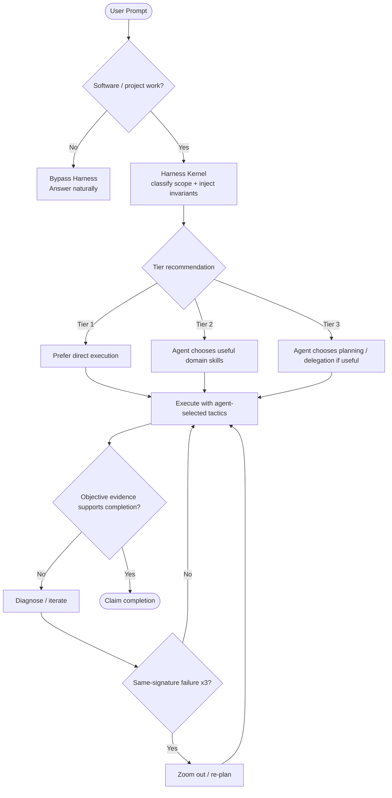
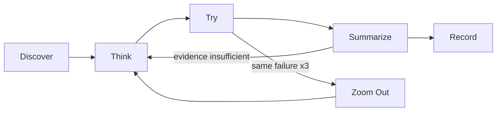

# Task Triage & Tier Details

Harness uses tiers to estimate scope and surface useful capabilities. A tier is **not** a fixed pipeline. The runtime enforces a very small set of cross-cutting invariants and leaves tactics, skill choice, ordering, and delegation to the agent.

> Architecture rule: **Do not enforce workflow order. Enforce workflow invariants.**

## 0. When Harness Routing Applies



### Bypass Rules

- **Pure chat, translation, general web search, non-software writing:** bypass Harness routing.
- **Software engineering / codebase / project work:** establish the Harness Kernel contract before mutating work, even when the prompt already names a domain skill such as `tdd`, `security-review`, or `repo-docs`.

A host may auto-select a peer/domain skill. That selection must not be treated as proof that Harness routing already happened.

## 1. The Minimal Harness Kernel

The kernel exists to keep strong models free while protecting the few behaviors that should not disappear under autonomous skill selection.

### Mandatory invariants

1. **Route before execution** — establish task scope/tier before mutating software work.
2. **Verify before claim** — completion claims require objective evidence appropriate to the change.
3. **Re-plan on repetition** — after three same-signature failures, stop micro-retrying and use a fresh diagnosis / `zoom-out`.

These are the rails. Everything else is agent judgment unless the user or an authoritative project document explicitly requires it.

### What is intentionally *not* mandatory

- Loading `todo-driven-workflow` for every Tier 2/3 task.
- Running TDD for changes where executable behavioral tests do not add value.
- Entering Fable/multi-agent mode merely because the task is Tier 3.
- Following a universal `TODO → TDD → verification-loop` or `Fable → subagent → verification-loop` sequence.
- Loading `install-cognitive-os` as a peer skill before every other skill.

`install-cognitive-os` remains the human-readable/manual entry point for the cognitive policy. Supported runtime integrations should establish the kernel invariants without depending on that skill being selected first.

## 2. Routing Mechanism

Use the public kernel entry point:

```bash
node "<this-skill-dir>/scripts/kernel-router.js" "<brief prompt summary>"
```

or:

```bash
npx github:dyphn1/Harness-everything next "<brief prompt summary>"
```

`kernel-router.js` delegates classification and guide discovery to `tier-router.js`, removes legacy fixed-pipeline instructions, and emits:

- the recommended tier and rationale,
- the **required Harness invariants**,
- **suggested skills** marked advisory,
- the policy that the agent may choose the smallest useful skill/tool set.

If a host's `UserPromptSubmit` integration already ran the kernel this turn, reuse that output rather than running it twice.

The tier classifier is heuristic. Treat its result as the default route, not an oracle. A clear task reading or explicit user instruction may override it; record the reason when doing so.

## 3. Tier Guidance

### Tier 1 — Trivial

Typical shape:
- typo/small documentation correction,
- simple local code edit,
- narrow explanation,
- straightforward Git operation.

Default behavior:
- prefer direct execution,
- avoid large plans and unnecessary delegation,
- load a focused skill only when it materially improves the result,
- still verify any completion claim with evidence appropriate to the change.

### Tier 2 — Standard

Typical shape:
- a specific feature or bug fix,
- multi-file coordination,
- behavioral changes needing tests,
- focused benchmark/review work.

Common **suggestions**, not a pipeline:

| Need observed in the task | Useful skill |
|---|---|
| Several verifiable steps need explicit tracking | `todo-driven-workflow` |
| Behavior can be specified by executable tests | `tdd` |
| Delivery needs systematic build/lint/test/diff evidence | `verification-loop` |
| Auth/input/secrets/network boundaries are touched | `security-review` |
| Isolated workspace would reduce risk | `using-git-worktrees` |
| Quantitative scoring/benchmarking is requested | `eval-harness` |

The model decides which of these are useful and in what order. It may use none, one, or several while preserving the kernel invariants.

### Tier 3 — Macro

Typical shape:
- repository-wide or architectural changes,
- large ambiguous requirements,
- broad documentation/system design,
- work where deliberate delegation may reduce risk or improve coverage.

Common **suggestions**, not a pipeline:

| Need observed in the task | Useful skill |
|---|---|
| Deliberate macro planning / model-mode selection | `fable-mode`, `fable-discipline` |
| Bounded parallel delegation genuinely helps | `multi-agent-workspace` |
| Project-level docs need creation/update | `repo-docs` |
| Important decisions need challenge before implementation | `grill-with-docs` |
| Settled intent needs a spec | `to-spec` |
| Settled work needs tracer-bullet issues | `to-tickets` |

Tier 3 does **not** automatically require multi-agent execution. A strong model may complete macro work directly when that is the safer/smaller choice.

## 4. Cognitive OS Relationship

The cognitive loop remains useful:



But this diagram describes a reasoning policy, not a peer-skill dependency graph. Domain skills may implement their own local phases and gates. They do not need to invoke `install-cognitive-os` first as long as the Harness invariants remain satisfied.

## 5. Host Integration and Enforcement Strength

| Host mode | Expected behavior |
|---|---|
| Lifecycle hook available | Run the Harness Kernel on prompt submission so routing context exists before domain-skill execution. Hard gates may enforce supported invariants at tool/stop boundaries. |
| Advisory instructions only | Tell the agent to run/reuse `harness next` before software mutation and `harness verify` before completion. The behavior is advisory, not a hard gate. |
| Manual use | Invoke `harness-everything` or `install-cognitive-os` explicitly to inspect/re-establish the contract. |

Never describe an advisory integration as hard enforcement. Platform-specific adapters may differ while preserving functional intent.

## 6. Routing Checkpoint

When a visible checkpoint is useful, keep it small:

```markdown
## 🚦 Harness Routing Checkpoint
- Tier: Tier X — <reason>
- Required invariants: route-before-execution; verify-before-claim; re-plan-after-3-same-failures
- Suggested skills: <only the skills that appear useful>
```

The checkpoint reports state; it does not prescribe a universal workflow.

## 7. Self-Healing and Dynamic Skills

Existing self-heal, generated-skill discovery, knowledge-guide matching, and fact-audit behavior remain part of the classifier/runtime. They may recommend resources but should not silently convert recommendations into mandatory pipeline stages.

If bootstrap reports missing integration touchpoints, use the existing self-heal command:

```bash
node "<this-skill-dir>/scripts/self-heal.js"
node "<this-skill-dir>/scripts/self-heal.js" --check
```

Respect an explicit user choice to remove/disable an integration.
