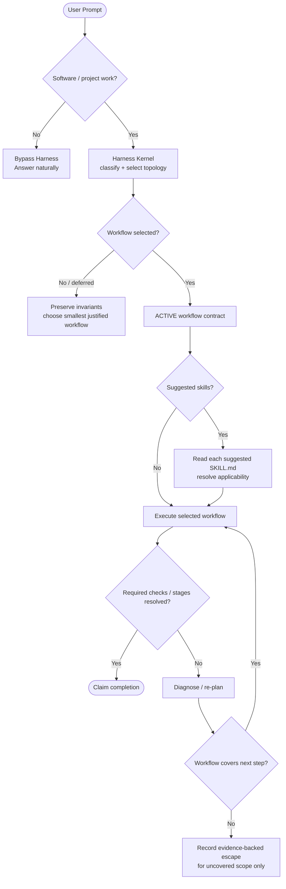
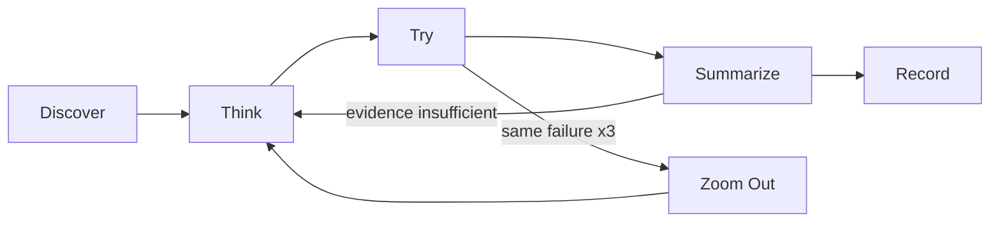

# Task Triage & Tier Details

Harness uses tiers to estimate scope and select the smallest sufficient execution topology. A tier is **not** a fixed TODO/TDD/Fable pipeline. Once the router selects an applicable topology, however, that topology becomes the run's execution contract.

> Architecture rule: **Mandatory applicable workflow; flexible reasoning/implementation inside it; evidence-backed escape only for workflow-uncovered scope.**

## 0. When Harness Routing Applies



### Bypass Rules

- **Pure chat, translation, general web search, non-software writing:** bypass Harness routing.
- **Software engineering / codebase / project work:** establish the Harness Kernel contract before mutation, even when the prompt already names a domain skill.

Host skill selection is not proof that Harness routing already happened.

## 1. Minimal Kernel Contract

The kernel protects lifecycle obligations without micromanaging model reasoning.

### Mandatory invariants

1. **Route before execution** — establish task scope/tier and the smallest justified topology.
2. **Verify before claim** — completion requires objective evidence appropriate to the change.
3. **Re-plan on repetition** — after three same-signature failures, stop micro-retrying and use a fresh diagnosis / `zoom-out`.
4. **Evaluate before omission** — when the router suggests a skill, read its complete `SKILL.md` entry/basic flow before deciding applicability.
5. **Resolve selected workflow** — once a topology is selected, execute it to a resolved state; "simple", "routine", "already clear", or model confidence are not escape conditions.

The model remains free to choose tools, implementation technique, decomposition details, and reasoning inside the workflow.

### What is intentionally *not* mandatory

- One universal `TODO → TDD → verification-loop` sequence for every Tier 2/3 task.
- Multi-agent execution merely because a task is Tier 3.
- Every router-suggested skill when its evaluated flow is objectively not applicable.
- Every optional deep-dive/reference linked from a skill.

A suggested skill may resolve as `use`, `not-applicable`, or `unresolved/unavailable`. `not-applicable` needs a flow-grounded reason; a metadata-only or confidence-only judgement is insufficient. The selected **topology** is different: it is mandatory after selection unless an explicit workflow escape records genuinely uncovered scope plus evidence.

## 2. Routing Mechanism

Use the public kernel entry point:

```bash
node "<this-skill-dir>/scripts/kernel-router.js" "<brief prompt summary>"
# or
npx github:dyphn1/Harness-everything next "<brief prompt summary>"
```

`kernel-router.js` delegates classification/guide discovery to `tier-router.js` and emits:

- recommended tier + rationale,
- structured workflow plan,
- compact **Harness Routing Checkpoint**,
- required invariants,
- suggested skills whose applicability must be evaluated,
- **Workflow Execution Contract** for the selected topology.

If `UserPromptSubmit` already ran the kernel this turn, reuse that output. Do not infer a silent Tier 1/direct path from missing or degraded routing.

### Suggestion applicability contract

For every router-suggested skill:

1. Read the complete `SKILL.md` entry.
2. Evaluate `USE FOR`, `DO NOT USE FOR`, workflow/basic flow, and hard rules.
3. Read extra material only when the entry explicitly requires it to decide applicability.
4. Resolve the suggestion as `use`, `not-applicable`, or `unresolved/unavailable`.

A name, description, router summary, tier label, or generic "routine/common task" judgement is not enough to mark a suggestion not applicable. Using one suggestion does not resolve the others automatically.

### Workflow escape contract

Escape is an exception path, not an alternative default. Use it only when the selected topology genuinely cannot represent part of the task. Record:

- a permitted reason code,
- the uncovered scope,
- evidence explaining the coverage gap.

Covered workflow obligations remain mandatory. Host capability loss must be visible as degradation/blocked/escape evidence, never silently converted into optional execution.

## 3. Tier Guidance

### Tier 1 — Trivial

Typical shape: typo/small docs correction, narrow local edit, bounded explanation, straightforward Git operation.

Default topology is normally `direct-single`. Keep the lifecycle minimal, but still satisfy applicable scope/safety/verification obligations.

### Tier 2 — Standard

Typical shape: specific feature/bug fix, multi-file coordination, behavioral change, focused benchmark/review.

The router normally selects `iterative-single`: bounded reason/act work plus objective verification. It may surface `tdd`, `verification-loop`, `security-review`, `using-git-worktrees`, or other focused skills. Those suggestions are applicability decisions, not a universal sequence.

When an evaluated skill is applicable, follow its workflow rather than reading it and then discarding it because the implementation seems obvious.

### Tier 3 — Macro

Typical shape: repository-wide/architectural work, large ambiguous requirements, cross-source synthesis, or bounded delegation.

The router may select `fable-staged`, `fable-parallel`, or `fable-multi-agent-workspace`. A selected Fable topology is not advisory: enter its stage-contract lifecycle, honor dependency/write-set constraints, run objective checks, synthesize, cold-verify where required, and use bounded re-planning on failure.

Tier 3 does **not** automatically mean multi-agent; the router still chooses the smallest sufficient topology.

## 4. Cognitive OS Relationship



This describes a reasoning policy. The workflow contract governs lifecycle obligations; domain skills may define their own local phases inside it.

## 5. Host Integration and Enforcement Strength

| Host mode | Expected behavior |
|---|---|
| Lifecycle hooks available | Kernel creates the selected workflow contract. Supported PreToolUse/Stop gates may mechanically prevent known bypasses. |
| Advisory instructions only | Agent is instructed to establish and resolve the same contract, but the host cannot be described as mechanically enforcing it. |
| Manual use | Invoke `harness-everything` / `harness next`, then execute the selected topology explicitly. |

On Claude, an active selected Fable topology uses a PreToolUse workflow gate to prevent direct parent artifact mutation before a correlated Fable run exists, plus a Stop-time completion gate for unresolved stage contracts. Other selected topologies still rely on their applicable mechanisms (for example objective verification/stop gates) and shared contract text.

Never turn mechanism/package evidence into a cross-host live-enforcement claim. #82 owns host-specific retained evidence.

## 6. Routing Checkpoint

For software/project work, surface this state before or with the first progress update:

```markdown
## 🚦 Harness Routing Checkpoint
- Tier: Tier X — <reason>
- Strategy: <selected/deferred strategy>
- Workflow state: <active | deferred | blocked | escaped>
- Required invariants: <router invariants>
- Suggested skills: <deduplicated suggestions or none>
- Suggestion applicability: <use | not-applicable + reason | unresolved/unavailable>
- Escape: <none | reason + uncovered scope + evidence>
```

The checkpoint is state, not a universal response template. The key distinction is: **skill suggestions are evaluated for applicability; a selected workflow topology is executed to resolution.**

## 7. Self-Healing and Dynamic Skills

Self-heal, generated-skill discovery, knowledge-guide matching, and fact-audit behavior remain part of the runtime. Dynamic recommendations still require applicability evaluation.

If bootstrap reports missing integration touchpoints:

```bash
node "<this-skill-dir>/scripts/self-heal.js"
node "<this-skill-dir>/scripts/self-heal.js" --check
```

Respect an explicit user choice to remove/disable an integration.
