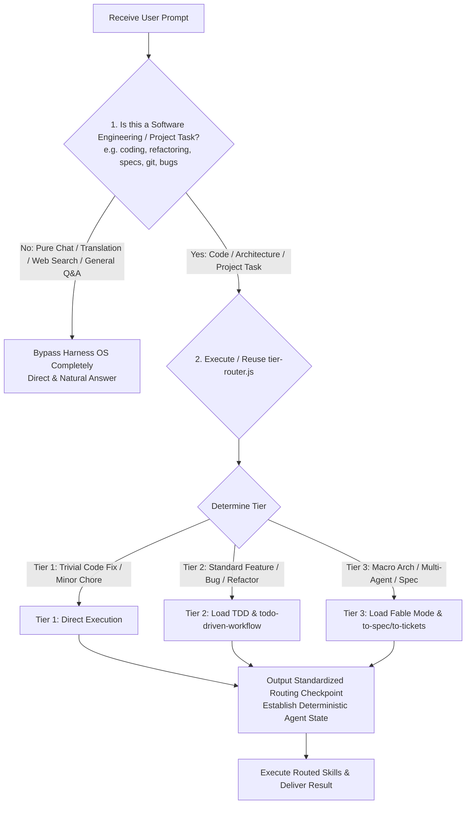

# Task Triage & Tier Details (moved from SKILL.md)

## 0. Non-Software Task Bypass Decision Matrix

Follow the decision matrix below to determine whether Harness OS routing applies:



#### Bypass Rules:
- **Pure Conversations / General Tasks**: If the user prompt is general Q&A, text translation, web searching, or non-software writing, **BYPASS** `harness-everything` completely. Do NOT output a Routing Checkpoint block; reply directly and naturally.
- **Software Engineering / Codebase Tasks**: **MUST** output the standardized `🚦 Harness OS Routing Checkpoint` block at the top of the response to establish a deterministic status contract across different AI models.

## 1. Core Rule: Global Underlying OS & Base Execution Loop
Before taking any action, you must awaken and load the principles of `install-cognitive-os`.
No matter how simple the task is, your behavior must comply with the **Discover > Think > Try > Summarize > Record** cognitive loop.
Never rush to act before understanding the environment; establish contextual awareness first.

**Base Execution Loop (`todo-driven-workflow`)**: The cognitive loop above defines *how you think*; `todo-driven-workflow` defines *how you execute*. For every **Tier 2 and Tier 3** task, you MUST load `todo-driven-workflow` and initialize its checklist BEFORE editing any file — it is the foundational step-by-step execution layer of this harness (break down into 3-7 verifiable sub-tasks, one `in-progress` at a time, verify with real evidence before marking `completed`). Tier 1 tasks are exempt to avoid checklist bloat.

**Always-On Disciplines** (apply on every tier, alongside the loops above):
- `fable-mode/execution-guardrails` — verify-before-flag, warning batching, find-and-replace safety. These are behavioral contracts, not Tier-3-only rules.
- `verify-before-claim` — never assert external framework/API behavior or unmeasured performance numbers from training memory; verify against an authoritative source first.
- `install-cognitive-os`'s Global Output Normalization — lead with direct answers, suppress preambles/recaps/pleasantries, and enforce natural locale terminology (§6).

**Self-Healing Toolchain (工欲善其事,必先利其器)**: The harness may have been installed from a different editor than the one currently running (e.g., installed via Claude Code, now opened in Copilot). During the `[Discover]` phase, audit the workspace's integration touchpoints and repair any that are missing — the script is idempotent and delegates to the installer, so re-running is always safe:
```bash
node "<this-skill-dir>/scripts/self-heal.js"          # audit + auto-repair missing touchpoints
node "<this-skill-dir>/scripts/self-heal.js" --check  # audit only, never writes
```
Also run this immediately whenever the `bootstrap.js` SessionStart output shows a `[Self-Heal] Missing integration touchpoints` warning. Exception: if the user says they intentionally removed one of these files, respect that and do not re-create it.

## 2. Task Triage
To avoid "over-engineering" and maximize efficiency, you must categorize the user's task during the `[Think]` phase and take the corresponding action path.

**Thinking Discipline (Law of Elimination & Prediction - 預判與刪除定律)**:
During the `[Think]` phase, analyze requirements and perform forward prediction before taking action. Use elimination early to prune unviable paths, skip scanning directories known to be unrelated, or discard strategies guaranteed to fail (e.g. skip executing a test suite on a file that has obvious syntax errors). Focus your limited attention solely on high-value, highly-relevant files to minimize failure costs.

- **MANDATORY**: Run the Tier Router script before deciding the tier. The script lives at `scripts/tier-router.js` **inside this skill's own directory** — resolve the path from wherever this SKILL.md was loaded (do not guess a hard-coded location):
  ```bash
  node "<this-skill-dir>/scripts/tier-router.js" "<Brief summary of the user's prompt>"
  ```
- Treat the script's `RECOMMENDED TIER` as the default route — the same rule the router itself prints. If your own read of the task clearly disagrees (the router is a keyword heuristic, not an oracle), follow your read and state why in one line in the Routing Checkpoint. An explicit instruction from the Human Partner always wins.
- If a `UserPromptSubmit` hook already ran the router this turn (its `[Tier Routing Pre-check]` output is visible in context), reuse that output instead of running it again.

### Mandated Routing Checkpoint Output
At the very beginning of your response to the user, you **MUST** output a clear, stylized routing report. This report is mandatory for all entries via `harness-everything`. It must list the determined Tier and the exact routing targets:
```markdown
## 🚦 Harness OS Routing Checkpoint
- **Active Tier**: Tier X (Tier Name)
- **Rationale**: Short 1-sentence reason from the tier router.
- **Routed Skills, Guides & Actions**:
  - `path/to/skill/or/guide.md` (Brief description of why this applies)
  - ...
```

### Proactive Copilot & VS Code Instruction (Avoid Silent Degrades)
If you are running in VS Code or GitHub Copilot, you do not have automated hooks to run scripts on your behalf.
- You **MUST** proactively run the tier-router script (`node "<this-skill-dir>/scripts/tier-router.js" "<prompt>"` or `npx github:dyphn1/Harness-everything next "<prompt>"`) or simulate its routing logic manually at the start.
- **NEVER degrade newly added features or structural extensions to Tier 1.** Copilot is highly prone to treating new feature requests as trivial Tier 1 direct edits. If the request adds *any* new logic, a new API endpoint, or a new file/module, it **MUST** be triaged as **Tier 2 (Standard Task)** or **Tier 3 (Macro Task)**. This activates:
  1. The `todo-driven-workflow` checklist (mandatory step-by-step progress tracking).
  2. Multi-agent spawning / sub-agents via `multi-agent-workspace` or macro plan orchestration via `fable-mode`.
  3. The memory summarization & evolution sequence via `self-evolve` upon completion, ensuring new knowledge is registered in workspace memory.

### Tier 1: Trivial Tasks & Daily Chores
- **Characteristics**: Fixing typos, simple modifications to a single function, asking/explaining code, syntax adjustments. Or simple `git-commit` and `rewrite-commits`.
- **Action Strategy (Direct Execution)**:
  - **PROHIBITED** from writing large plans.
  - **PROHIBITED** from calling `multi-agent-workspace` or `fable-mode`.
  - Execute the modification directly based on requirements, or load `git-commit` / `rewrite-commits`. Perform a simple `[Record]` after modifying.

### Tier 2: Standard Tasks & Architectural Review
- **Characteristics**: Adding a single API endpoint, fixing a specific bug, modifications requiring coordination across 2-3 files. Or requiring stress testing and benchmark evaluation for specific designs.
- **Action Strategy (TDD, Deep Context & Domain Expertise)**:
  - **Initialize the Base Execution Loop**: Load `todo-driven-workflow` and lay out the checklist first (the TDD Red/Green/Refactor phases map naturally onto todo items).
  - **Information Depth Requirement**: Before entering TDD, you MUST perform a deep context trace (find references, call sites, and related interfaces). Superficial fixes that break dependencies are strictly forbidden.
  - **Load Domain Experts (領域專家召喚)**: Based on the tech stack detected in Tier 1, explicitly search for and load the corresponding **Domain Skills** (e.g., `security-review` from this repo, or `frontend-patterns` / `api-design` from the user's legacy skill library) to inject robust expert knowledge into your context.
  - Development tasks: Automatically load and follow the `tdd` (Test-Driven Development) skill. Write tests first (Red) -> Implement (Green) -> Refactor.
  - Before starting feature work on a busy repository, consider loading `using-git-worktrees` to isolate your workspace and prevent workspace pollution.
  - **Optional, non-blocking**: if the task introduces a new command/flag, API endpoint, or data shape, consider offering `to-spec` to write the matching lightweight doc (`cli-reference` or `schema-doc` template) before implementing — this is advisory only, skip it for straightforward single-function fixes, and never let it delay or gate TDD.
  - If the user requests grilling or refactoring a plan, load `grill-me` (pure Q&A) or `improve-codebase-architecture` (deep architectural analysis).
  - If the user requests "scoring" or "benchmark comparison", load `eval-harness` for quantitative scoring and summarization.
  - **Pre-Delivery Gate**: Before declaring the task done or creating a PR, load `verification-loop` (build / types / lint / tests / security scan / diff review). For changes touching auth, input handling, secrets, or network boundaries, additionally load `security-review`.

### Tier 3: Macro Tasks & Documentation
- **Characteristics**: New project initialization, low-level architecture refactoring, vague and massive requirements (e.g., "Help me write a user login system"). Or lack of global documentation.
- **Action Strategy (Multi-Agent Orchestration & Domain Infusion)**:
  - If initializing a multi-agent system workspace, load `multi-agent-workspace` to scaffold the 6 functional zones, memory index, immutable router, and agency catalog.
  - If project-level documentation needs to be created, load `repo-docs`.
  - If establishing a large system design, strongly recommend loading `grill-with-docs` first to document decisions (ADR, CONTEXT) before proceeding. Once those decisions are settled, load `to-spec` to synthesize the conversation into whichever doc shape fits — a full feature spec (PRD) is the common case here, but `to-spec` also covers CLI/API reference, schema doc, and dev-doc shapes for narrower Tier 3 work. `to-spec` never re-interviews; if it hits an unresolved fork, that's a sign `grill-with-docs`/`grill-me` needed another pass first, not a cue to ask ad hoc questions.
  - `to-spec` is advisory in both Tier 2 and Tier 3 — never a required gate. Its own internal Step 0 is mechanized, not advisory: it runs `node to-spec/scripts/check-project-docs.js check` to see whether this repo's own `harness-everything/manifest.json` already has a complete `projectDocs` entry (document location + issue tracker + issue definition) — Exit 0 skips straight past it, Exit 1 runs a one-time setup interview and persists the answer via the script's `init` subcommand. That reuses the same manifest this package and `self-evolve` already own, repo-local only (never the global `~/.agents`/`~/.claude` homes, since this data must not leak across projects). Its output is what `to-tickets` reads to cut clean vertical slices afterward.
  - Once a `to-spec` feature spec exists (or the user just wants an already-settled plan/conversation broken down directly), load `to-tickets` to cut it into tracer-bullet tickets with declared blocking edges. It runs the *same* `check-project-docs.js check` gate `to-spec` does — never a second copy of that interview — and publishes through the identical `tracker`/`issueDefinition` fields, so the repo only ever answers "where do issues live" once. Quizzes the user on the proposed breakdown (granularity, blocking edges) before publishing; never forces multi-ticket decomposition onto a `to-spec` doc that was already a single unit of work (a `cli-reference`/`schema-doc`/`dev-doc` shape).
  - **Sub-Agent Specialization**: When calling `multi-agent-workspace`, you MUST inject robust Domain Skills into the sub-agent's persona (e.g., selecting an agency specialist for a Backend Sub-Agent). Do not create generic, empty-shell agents.
  - Development execution: Automatically load `fable-mode` and `fable-discipline`. The macro plan produced in fable-mode's Discovery phase MUST be materialized as the `todo-driven-workflow` checklist — sub-agent handoffs and milestone checks are tracked there, not in prose.
  - **Pre-Delivery Gate**: Same as Tier 2 — run `verification-loop` (and `security-review` where applicable) before the final handoff.

# Always-On ADHD-Friendly Output Shaping

This is the same always-on discipline `install-cognitive-os` defines under its own §"Global Output Normalization" — this router doesn't restate it (that duplication was flagged in a skill quality audit §1.1 and has been removed). Since §1 already sends every task through `install-cognitive-os` before any action, its output-shaping rules are already in effect by the time this router does anything — apply them as written there, on every response, regardless of tier.
