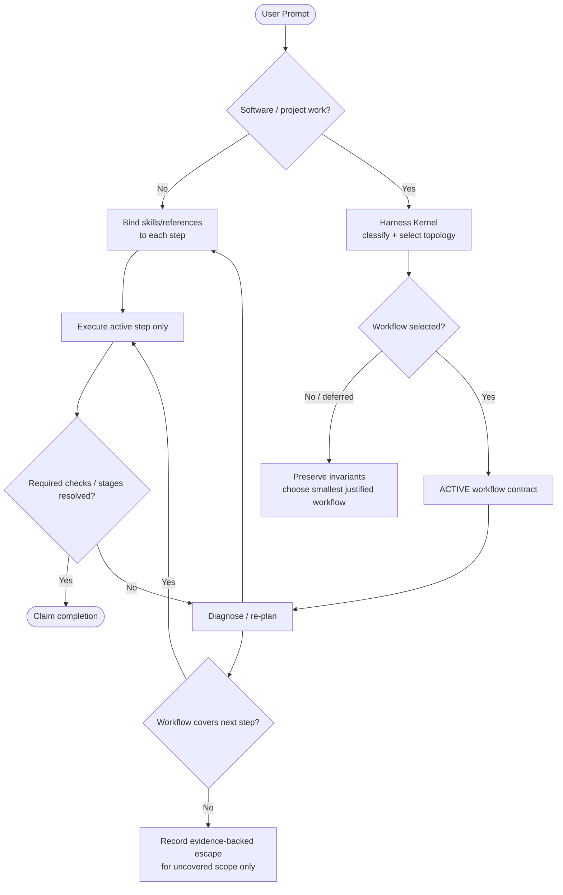
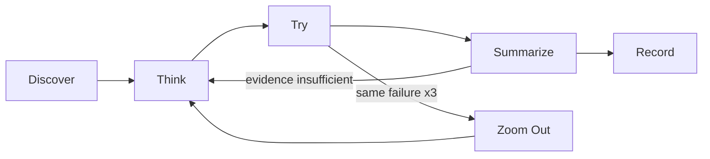

# Task Triage & Tier Details

Harness uses tiers to estimate scope and select the smallest sufficient execution topology. A tier is **not** a fixed TODO/TDD/Fable pipeline. Once the router selects an applicable topology, however, that topology becomes the run's execution contract.

> Architecture rule: **Contract-first lifecycle; flexible reasoning/implementation; semantic MUSTs may be reminder-observed, while only Rule-of-3 reflection and explicit permission boundaries may hard-block.**

## 0. When Harness Routing Applies


```mermaid
flowchart TD
    U([User Prompt]) --> S{Software / project work?}
    S -- No --> B[Bypass Harness<br/>Answer naturally]
    S -- Yes --> K[Harness Kernel<br/>classify + select topology]
    K --> W{Workflow selected?}
    W -- No / deferred --> D[Preserve invariants<br/>choose smallest justified workflow]
    W -- Yes --> A[ACTIVE workflow contract]
    A --> P[Decompose requirements<br/>into ordered steps]
    P --> B[Bind skills/references<br/>to each step]
    B --> E[Execute active step only]
    E --> V{Required checks / stages resolved?}
    V -- Yes --> O([Claim completion])
    V -- No --> P[Diagnose / re-plan]
    P --> X{Workflow covers next step?}
    X -- Yes --> E
    X -- No --> C[Record evidence-backed escape<br/>for uncovered scope only]
```

### Bypass Rules

- **Pure chat, translation, general web search, non-software writing:** bypass Harness routing.
- **Software engineering / codebase / project work:** establish the Harness Kernel contract before mutation, even when the prompt already names a domain skill.

Host skill selection is not proof that Harness routing already happened.

## 1. Minimal Kernel Contract

The kernel protects lifecycle obligations without micromanaging model reasoning.

### Mandatory invariants

1. **Route before execution** — establish task scope/tier and the smallest justified topology.
2. **Verify before claim** — completion requires objective evidence appropriate to the change.
3. **Re-plan on repetition** — after three same-signature failures, stop micro-retrying and use a fresh diagnosis / `zoom-out`.
4. **Bind knowledge by step** — compose ordered requirement steps and declare required/optional skills or references before execution.
5. **Resolve selected workflow** — selected-topology required obligations are semantic MUSTs; implementation tactics MAY adapt where the contract allows.
6. **Surface status** — non-trivial software/project work MUST use the single Harness Status format at required phase boundaries.

The model remains free to choose tools, implementation technique, decomposition details, and reasoning inside the workflow.

### What is intentionally *not* mandatory

- One universal `TODO → TDD → verification-loop` sequence for every Tier 2/3 task.
- Multi-agent execution merely because a task is Tier 3.
- Every keyword-matched skill/reference regardless of whether an active requirement needs it.
- Every optional deep-dive/reference linked from a skill.

Keyword/domain matches are normalized planning signals, not document selectors. Each ordered step declares its required and optional skill/reference bindings; only the active step or dependency-ready Fable stage exposes those paths. Read a required skill's complete entry and follow its applicable core contract before the step passes. Required bindings without a known path remain visible and unresolved. Optional bindings resolve as loaded or not-needed. Hooks may remind, but missing bindings do not hard-block ordinary tools or Stop.

## 2. Routing Mechanism

Use the public kernel entry point:

```bash
node "<this-skill-dir>/scripts/kernel-router.js" "<brief prompt summary>"
# or
npx github:dyphn1/Harness-everything next "<brief prompt summary>"
```

`kernel-router.js` delegates classification/knowledge-signal detection to `tier-router.js` and emits:

- classified tier + rationale,
- structured workflow plan,
- compact **Harness Routing Checkpoint**,
- required invariants,
- normalized knowledge signals that help compose requirement steps, not paths to read,
- ordered requirement steps and their active required/optional bindings after planning,
- **Workflow Contract** for the selected topology.

If `UserPromptSubmit` already ran the kernel this turn, reuse that output. Do not infer a silent Tier 1/direct path from missing or degraded routing.

### Active binding contract

- Before a selected Tier 2/3 workflow starts, decompose the request into ordered requirement steps and confirm the smallest sufficient topology.
- Put a required skill/reference only on steps whose acceptance criteria need it; put optional knowledge on its actual consumer step.
- Load/resolve only bindings for the active step. Do not print or preload future-step bindings.
- A required binding MUST resolve as loaded before the step passes; optional bindings resolve as loaded or not-needed. Unknown/unavailable required bindings stay visible and unresolved.
- Fable uses its existing dependency/write-set graph as the step graph. Only dependency-ready stage bindings are disclosed; unresolved bindings keep a successful check at `binding-unresolved` until they are resolved and that exact check is rerun.

The binding disposition is an execution contract, not proof that a real host loaded a file. Preserve a host/session trace before making live-host claims. Missing evidence stays a reminder and does not create a persistent Harness lock.

### Workflow escape contract

Escape is audit metadata for a bounded contract exception. Use it only when the selected topology genuinely cannot represent part of the task. The permitted reason codes are:

- `workflow-uncovered-scope` — the selected topology cannot represent a bounded part of the task;
- `host-capability-unavailable` — the host lacks a capability required to execute the selected topology.

Every escape must name a declared stage in the correlated run and record the reason code, uncovered scope, and evidence explaining the coverage/capability gap. Host capability loss and missing isolation **MUST** remain visible as warnings/evidence, without creating a persistent execution lock.

## 3. Tier Routing

### Tier 1 — Trivial

Typical shape: typo/small docs correction, narrow local edit, bounded explanation, straightforward Git operation.

Default topology is normally `direct-single`. Keep the lifecycle minimal, but still satisfy applicable scope/safety/verification obligations.

### Tier 2 — Standard

Typical shape: specific feature/bug fix, multi-file coordination, behavioral change, focused benchmark/review.

The router normally selects `iterative-single`: bounded reason/act work plus objective verification. Compose ordered steps and bind TDD to behavior-change, verification-loop to verification, and domain references only to steps whose acceptance needs them. Keyword matches alone never select or load documents.

When an evaluated skill is applicable, follow its workflow rather than reading it and then discarding it because the implementation seems obvious.

### Tier 3 — Macro

Typical shape: repository-wide/architectural work, large ambiguous requirements, cross-source synthesis, or bounded delegation.

The router may select `fable-staged`, `fable-parallel`, or `fable-multi-agent-workspace`. A selected Fable topology is a semantic execution contract: its required stages, dependencies/write sets, checks, synthesis barrier, and verifier **MUST** resolve. Missing lifecycle evidence may produce reminders rather than a persistent workflow lock; fail-open mechanics do not make the contract optional.

Tier 3 does **not** automatically mean multi-agent; the router still chooses the smallest sufficient topology.

## 4. Cognitive OS Relationship


```mermaid
flowchart LR
    D[Discover] --> T[Think]
    T --> Y[Try]
    Y --> S[Summarize]
    S --> R[Record]
    S -- evidence insufficient --> T
    Y -- same failure x3 --> Z[Zoom Out]
    Z --> T
```

This describes a reasoning policy. The workflow contract governs lifecycle obligations; domain skills may define their own local phases inside it.

## 5. Host Integration and Enforcement Strength

| Host mode | Expected behavior |
|---|---|
| Lifecycle hooks available | Kernel records the selected semantic workflow contract. PreToolUse/Stop hooks observe/remind; Rule-of-3 and permission gates are the intentional blocking exceptions. |
| Instruction-only / advisory delivery | Agent receives the same MUST/SHOULD/MAY semantic contract without lifecycle observations or hard-enforcement claims. |
| Manual use | Invoke `harness-everything` / `harness next`, then execute the selected topology explicitly. |

On Claude and the local OpenAI package, supported hooks observe workflow/worktree/verification state and emit reminders. Rule-of-3 reflection and explicit action/permission gates remain separate blocking boundaries.

Never turn mechanism/package evidence into a cross-host live-enforcement claim. #82 owns host-specific retained evidence.

## 6. User-visible status contract

For non-trivial software/project work, user-facing progress **MUST** use one stable Markdown shape across direct, iterative, Fable, and multi-agent execution:

```md
### 🚦 Harness Status

- **Current:** <what is being done now>
- **Read / Evidence:**
  - <important file/source/evidence read or confirmed>
  - <another item when multiple evidence items improve scanability>
- **Next:** <next intended action>
- **Risk / Blocked:** <only when materially applicable; omit otherwise>
```

When there is only one short evidence item, keep it inline on the **Read / Evidence** bullet. Use nested bullets when multiple items would otherwise become one dense sentence.

Emit it before substantive execution, after a major phase completes, when the plan/assumption/direction materially changes, at meaningful phase boundaries during long-running work, and before final completion. The final response may merge the last status naturally.

This is a semantic communication MUST. It does **not** create a runtime lock, counter, reset requirement, or permission boundary. The routing checkpoint below is source state for this format, not a second competing progress template.

## 7. Routing Checkpoint

For software/project work, consume this internal runtime state when producing the first Harness Status; do not render the checkpoint as a separate user-facing block:

```markdown
## 🚦 Harness Routing Checkpoint
- Tier: Tier X — <reason>
- Strategy: <selected/deferred strategy>
- Workflow state: <pending | running | satisfied | deferred | blocked>
- Required invariants: <router invariants>
- Knowledge signals: <normalized planning inputs; not document paths>
- Active step: <ordered requirement id/type, with only its declared bindings>
- Escape: <none | reason + uncovered scope + evidence>
```

The checkpoint is runtime/source state, not a competing user-facing template. Render user progress through the single Harness Status contract above. The key distinction is: **active required bindings and selected-topology obligations are MUSTs; unrelated future knowledge stays undisclosed, while tactics MAY adapt.**

## 8. Self-Healing and Dynamic Skills

Self-heal and fact-audit behavior remain part of the runtime. Prompt keyword matches now emit normalized knowledge signals only; they do not discover or print dynamic skill/reference paths.

If bootstrap reports missing integration touchpoints:

```bash
node "<this-skill-dir>/scripts/self-heal.js"
node "<this-skill-dir>/scripts/self-heal.js" --check
```

Respect an explicit user choice to remove/disable an integration.

Related contracts: [router workflow plan](router-workflow-plan.md) and [skill registry](skill-registry.md).
