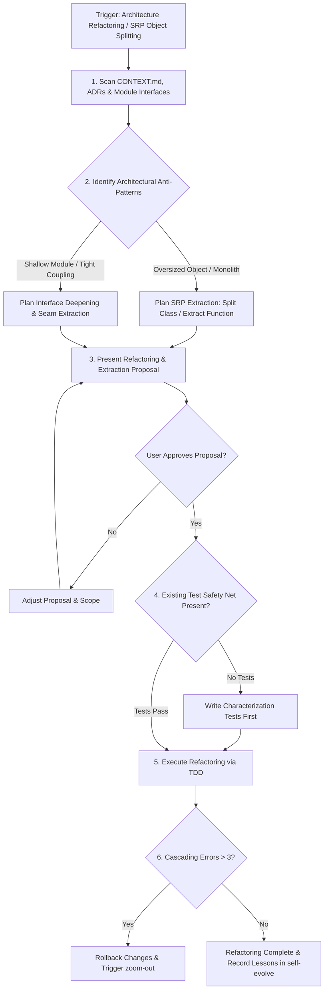

# Improve Codebase Architecture (Deep & SRP Refactoring)

## 📋 Skill Contract

| Component | Specification |
| :--- | :--- |
| **Trigger / Input** | Requests to "refactor architecture", "split object/class/function", "apply SRP / single responsibility", or resolve coupled tech debt. |
| **Expected Output** | "Deepening & SRP Refactoring" proposal, Characterization Tests safety net, and TDD-guided object/interface extraction. |
| **State Mutations** | Refactors module boundaries, extracts classes/functions/objects, creates characterization tests for legacy code. |
| **Enforcement Gate** | Must scan codebase & docs first. Write Characterization Tests before refactoring untested code. >3 cascading errors trigger rollback & zoom-out. |

## Process & Refactoring Flow

Follow the decision matrix below when refactoring codebase architecture or splitting objects:

## 1. Architectural Exploration & Discovery `[Discover]`
- **Blind Refactoring Prohibited**: Before proposing any modification suggestions, you MUST first scan `CONTEXT.md`, `docs/adr/`, and core interface definitions (Interfaces/Types).
- **Identify Refactoring Targets**:
  - **Single Responsibility Principle (SRP) Violations**: Oversized objects, classes, or functions (>300 lines or >10 cyclomatic complexity) handling multiple uncoupled concerns.
  - **Shallow Modules**: Complex, wide interfaces with minimal internal implementation.
  - **Improperly Coupled Seams**: Modules directly referencing implementation details instead of clean abstraction interfaces.

## 2. Analysis & Proposal `[Think]`
Use consistent domain terminology (Module, Interface, Implementation, Depth, Seam, SRP, Extraction) to communicate with the human.
- Submit a "Deepening & SRP Refactoring" proposal to the user detailing:
  1. **Object Splitting Strategy**: Which responsibilities will be extracted into focused helper objects or separate modules.
  2. **Interface Abstraction**: Which boundaries (Seams) will be extracted into clean interfaces or adapters.

## 3. Implementation Refactoring `[Try]`
- After gaining human approval, launch `tdd` mode.
- **Iron Rule of Refactoring**: MUST be done under the safety net of test coverage. If there are no tests, the first step MUST be to "write Characterization Tests for the legacy code" before modifying the architecture.
- **Extract Safely**: Extract objects/functions incrementally, verifying test suite execution after each atomic change.

## 4. Circuit Breaker & Evolution `[Summarize] & [Self-Evolve]`
- If refactoring triggers more than 3 cascading compilation errors that cannot be fixed immediately, trigger the `zoom-out` circuit breaker and Rollback.
- Write the discovered coupling traps into `self-evolve` memory, ensuring future newly generated code does not repeat the same mistakes.

## Deep Reference Guides
For precise architectural paradigms and deep module analysis, refer to:
- `improve-codebase-architecture/guides/DEEPENING.md` — Deepening opportunities & modular depth rules
- `improve-codebase-architecture/guides/INTERFACE-DESIGN.md` — Principles of interface design and seams
- `improve-codebase-architecture/guides/LANGUAGE.md` — Language-specific refactoring and pattern guidelines
- `improve-codebase-architecture/guides/HTML-REPORT.md` — Creating visual reports with Mermaid diagrams
