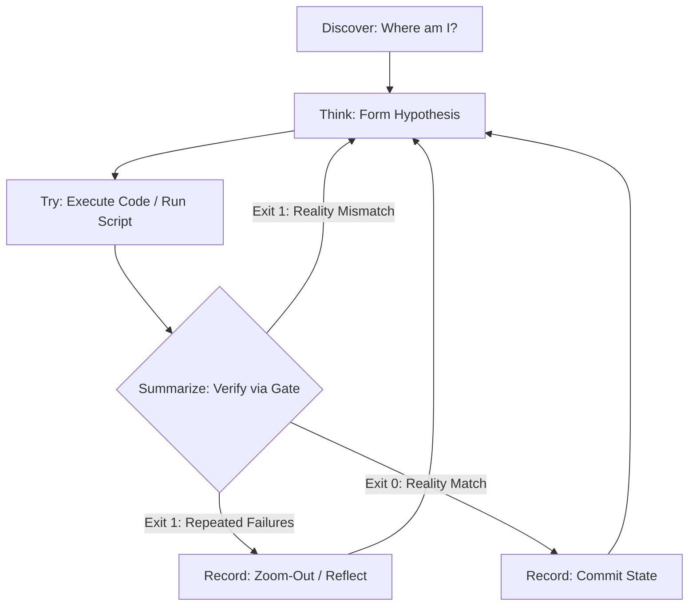

# Agent Cognitive OS (Underlying Cognitive System)

## 📋 Skill Contract

| Component | Specification |
| :--- | :--- |
| **Trigger / Input** | Always — the foundational cognitive loop every other skill in this repository builds on; loaded before any action on any task. |
| **Expected Output** | Every action passes through Discover → Think → Try → Summarize → Record, where Summarize is a script-gated reality check, not a self-assessment. |
| **State Mutations** | None of its own — it is the meta-loop other skills' state changes (e.g. `todo-cli.js complete`) run inside. |
| **Enforcement Gate** | Progress **MUST NOT** be recorded (`[Record]`) except after a verification script exits 0. A failing script (`verify-gate.js` or equivalent) forces a step back to `[Think]`; 3 consecutive failures forces `zoom-out` instead of a 4th blind retry. |

This skill defines the most fundamental physical laws of behavior that all Agents in the Harness Skills system must obey. 

## 🚫 The Anti-Linear Paradigm (拒絕直線思維)
Software engineering is **NOT a linear 1 -> 2 -> 3 -> Done process**. It is a cyclical process of hypothesis, execution, failure, and correction.
If you attempt to write code sequentially and assume it works without verification, you are hallucinating.
Your progression is **STRICTLY GATED** by terminal scripts (like `verify-gate.js` and `todo-cli.js`). If a script fails, you MUST step back, re-evaluate, and fix the issue. You cannot progress until the environment allows you to.

## Core Loop: The State Machine (Discover > Think > Try > Summarize > Record)

### 0. `[Discover]`: State Awakening & Deep Environment Discovery
- **Action**: Before any thinking or execution, you **MUST confirm where you are first**.
- **Environment Detection**: Detect the OS, and specifically verify the current shell/terminal environment.
- **Deep Information Exploration**: Do not stop at reading a single file. Trace dependencies, check call sites, and cross-reference with architectural docs.

### 1. `[Think]`: Form Hypothesis
- Before executing any command or modifying code, confirm your high-level intent.
- Predict possible failure paths. If a direction is doomed to fail, eliminate it early.

### 2. `[Try]`: Execution and Action
- Write the minimal amount of code to test your hypothesis.
- Run terminal commands to test the code.

### 3. `[Summarize]`: The Script-Gated Reality Check
- **CRITICAL**: You CANNOT summarize based on your own assumptions. You MUST run a verification script (e.g., tests, linter, `verify-gate.js`).
- If the script fails (Exit Code 1), you have been slapped by reality. You MUST step back to `[Think]`, diagnose the failure using the terminal output, and try again.
- **Deep Reflection**: If a trial fails 3 times, do NOT blindly retry. You MUST trigger a `zoom-out` reflection.

### 4. `[Record]`: Commit State
- ONLY when the verification script passes (Exit Code 0), you may use the task tracker (e.g., `todo-cli.js complete`) to record your progress and move to the next phase.
