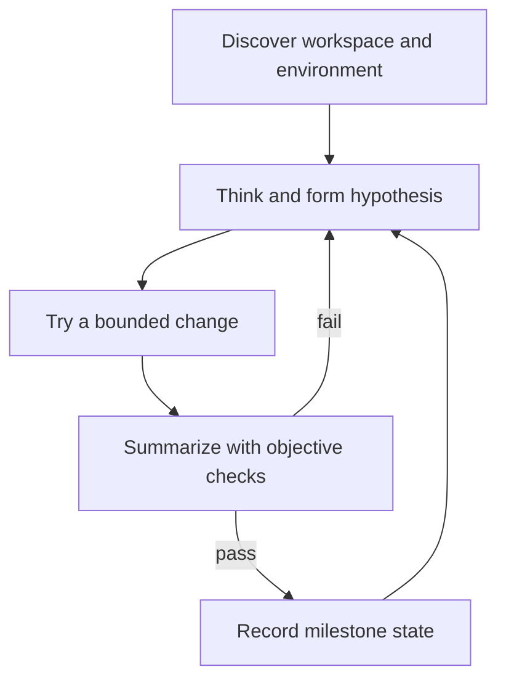

# Agent Cognitive OS — Full Reference

## The cyclical development paradigm

Software development is iterative: hypothesis, execution, feedback, and
refinement. Ground conclusions in objective verification (`npm test`,
`pytest`, `harness-everything/scripts/verify-gate.js`, or the project gate) and
an active native TODO tracker or Markdown checklist. When a check fails, return
to Think, inspect the evidence, and update the hypothesis.

## Core loop

## Platform note

See the repository README for the distinction between Claude Code's hard
hook enforcement and advisory-only platforms. Native TODO tools are preferred;
`tasks/todo.md` is the portable fallback.
