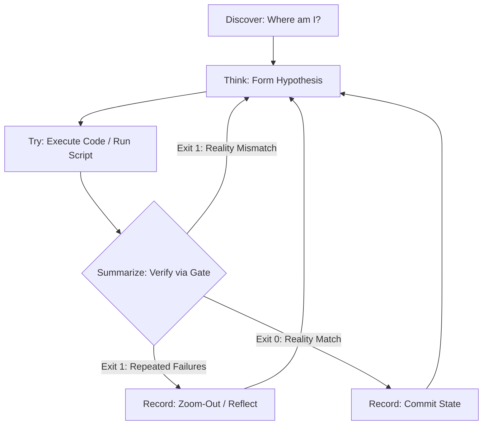

# Agent Cognitive OS — Full Reference

## The Cyclical Development Paradigm
Software development is iterative — a cycle of hypothesis, execution, feedback, and refinement. Rather than assuming code works immediately after writing it, ground progress in objective evidence from verification tools (project test suite `npm test`/`pytest`, `harness-everything/scripts/verify-gate.js`, or `npx github:dyphn1/Harness-everything verify`) and an active task tracker (`manage_todo_list` or `tasks/todo.md`). When checks fail, step back to analyze, adapt, and resolve before continuing.

## Core Loop State Machine

## Platform Enforcement Note

See the repo README § Supported AI IDEs & Tools for which platforms get hard boundary enforcement (`exit 2` hooks) vs. advisory only. On advisory-only platforms, execution hooks cannot physically block tool calls; all state transitions and verification gates operate as self-directed agent guidance.

## Communication & Output Formatting Guidelines

To maintain clarity and reduce conversational noise:

### 1. Lead with Substance
- **Direct Opening**: Start with the direct answer, code change, executed command, or key finding.
- **Avoid Conversational Filler**: Omit introductory phrases like "Sure!", "Great question!", or "Let me help you with that".

### 2. Autonomous Execution
- Complete actionable work (searching, editing, testing) directly using available tools rather than giving the user a manual script to run, unless blocked by credentials or external choices.

### 3. Bounded Actionable Steps
- Structure multi-step processes into concise, numbered items focused on single actions (prefer ≤5 items per section).

### 4. Clear Turn-by-Turn Progress
- For multi-phase tasks, briefly state current progress and the immediate next step.

### 5. Matter-of-Fact Error Diagnostics
- Present errors objectively: specify the failure location, observed output, root cause, and proposed fix.

### 6. Concise Responses
- Omit repetitive recaps of completed actions and polite closing pleasantries.

### 7. Language Consistency (Traditional Chinese / Taiwan)
- Align with the user's prompt language (defaulting to Taiwanese Traditional Chinese (`zh-TW`)).
- Use natural Taiwanese engineering terms: `程式碼`, `資料/資料庫`, `預設`, `資訊`, `相容`, `最佳化`. Keep technical identifiers, commands, paths, and standard English terms (`commit`, `PR`, `deploy`) in English.
