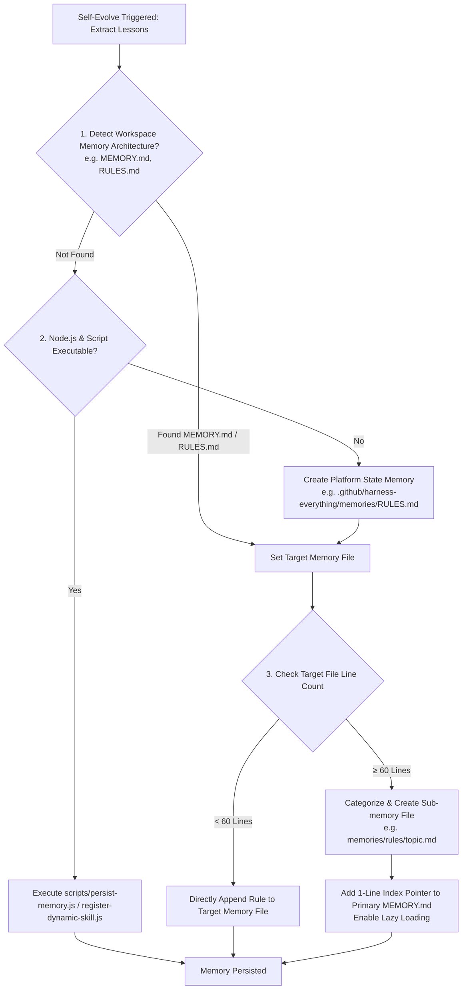

# Self-Evolve — Memory Resolution & Execution Details

Details moved from SKILL.md. Read when you need the full decision matrix or the reasoning behind the cleanliness rules.

## Responsibility Boundary

The host agent owns access to the current session and any history explicitly exposed by the host. It selects authorized evidence and states a generalized root cause before invoking this skill. `self-evolve` classifies, deduplicates, validates, and persists that result. It MUST NOT scan global transcript stores, persist raw transcripts, or act as a transcript daemon.

## Triggers

- **Post-Circuit Breaker**: Following successful recovery after a `zoom-out` reflection.
- **Major Breakthrough**: Upon completing complex tasks that revealed non-obvious framework limits or architectural edge cases.
- **Explicit Request**: When the user asks to "remember this lesson" or "save this to memory".

## Execution Process & Memory Resolution Flow

For a simple rule, persist only the generalized constraint or tip. For a reusable multi-step procedure, load `skill-creator/SKILL.md`, create the draft skill, and use `register-dynamic-skill.js` to update each platform's `manifest.json` `generated[]` registry. The host agent remains responsible for deciding which evidence is relevant; these scripts do not discover session history.

## Memory Resolution & Cleanliness Rules

1. **Workspace Memory Inspection First**:
   Before creating new memory files or running scripts, check if the workspace already maintains a primary memory file (such as `MEMORY.md`, `memories/repo/RULES.md`, `CLAUDE.md`, or `AGENTS.md`). If found, prioritize updating the existing structure.

2. **The 60-Line Cleanliness & Lazy Loading Rule**:
   To prevent Context Bloat and keep workspace memory organized:
   - **Under 60 Lines**: Append the concise, generalized defensive rule directly to the primary memory file.
   - **60 Lines or Greater**:
     - **Modular Split**: Extract the rule into a dedicated topic file under a sub-folder (e.g. `memories/rules/db-migration.md` or `.github/harness-everything/memories/rules/<topic>.md`).
     - **Index Pointer & Lazy Loading**: Add a single-line link/pointer in the primary `MEMORY.md` (e.g. `- [DB Migration Rules](memories/rules/db-migration.md)`). Future agent sessions will lazy-load the sub-memory file only when touching that specific domain.

3. **Script Tooling Fallback**:
   If Node.js and `persist-memory.js` are executable, run `node "<this-skill-dir>/scripts/persist-memory.js" "<rule>"`. If script execution fails or is unavailable, use the agent's file tools to append the same content directly to `memories/repo/RULES.md`.

4. **`self-regression.js` Is Not a Persistence Gate**:
   `self-regression.js` (aliased `npm test`) runs the Harness-everything meta-repo's own CI — syntax-checking its shipped scripts, its routing matrix, its behavioral-case validation, its mechanism suite. It is relevant only when this skill is used to modify *this repo's own* skill/script files (e.g. registering a dynamic skill here). It does not gate, and cannot resolve, ordinary rule persistence to a host workspace's `memories/repo/RULES.md` — `persist-memory.js`'s own dedup + quality-score check is the complete gate for that path, as the flow above shows (`RunScript --> Done`, no self-regression step).

## Purpose

Through `self-evolve`, we transform "invalid trial-and-error", which might otherwise waste Tokens, into a valuable "moat" for the system. Even if the underlying model doesn't become inherently smarter, equipped with these memories, the system will automatically avoid known traps and break through its original reasoning ceiling.
