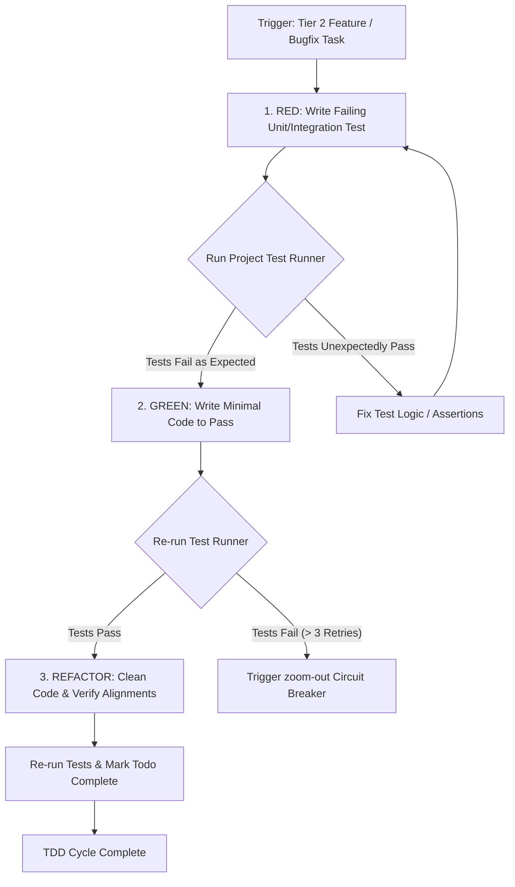

# TDD — Core Discipline (Full Detail)

## Process & TDD Execution Flow

Follow the decision matrix below when conducting TDD:

When this skill is loaded, you MUST suppress the urge to write implementation code directly, and strictly follow these three phases.

For public behavior, RED/GREEN evidence is necessary but not sufficient. Apply the machine-verifiable matrix, source-conformance policy, determinism comparison, and mandatory gates in `quality-model.md` before completion.

**Evidence Assertion (Law of Evidence Assertion - 證據斷言定律)**:
During each TDD phase (RED, GREEN, REFACTOR), you MUST present actual terminal test execution logs showing the exact test failure or pass. Claiming progress or success based on "assumed" passes is strictly PROHIBITED; you must assert outcomes with hard, objective evidence.

### 1. RED (Write a Failing Test)
- **Action**: Before implementing the requested feature or Bug fix, write the corresponding Unit Test or Integration Test in the test folder.
- **Validation**: Run the test to **ensure the test fails** (this proves the test actually covers unimplemented functionality, rather than being a fake test).
- **Note**: If the test passes immediately, it means your test is wrong or the Bug doesn't actually exist. You must fix the test.

### 2. GREEN (Implement Minimal Code to Pass Test)
- **Action**: Switch to the implementation code and write the "minimum amount of code just enough to pass the test". Do not over-engineer or consider future extensibility at this stage.
- **Validation**: Run the test to ensure it passes.

### 3. REFACTOR (Refactor and Optimize)

**Code-Doc Alignment (Law of Code-Documentation Alignment - 程式碼與文件對齊定律)**:
In the REFACTOR phase, you MUST verify that the implemented code actually aligns with the documented contracts and doesn't contain hardcoded mocking to "finesse" or cheat the tests. Use the `todo-driven-workflow` checklist items to audit that your implementation aligns 100% with the requirement specifications.

- **Action**: Under the safety net of passing tests, begin optimizing the code.
- Checks: Is the naming clear? Is there duplicated code? Can performance be improved? Does it comply with the project's Clean Code standards?
- **Validation**: After every modification, re-run the tests to ensure refactoring hasn't broken the original functionality.

## Circuit Breaker Defense
If during a TDD cycle you get stuck in the **GREEN phase**, and 3 consecutive implementation attempts fail to pass the test:
- **Trigger Condition Met**: You might have hit the reasoning ceiling, or the initial test logic (RED) was written incorrectly.
- **Mandatory Action**: Stop guessing blindly. Immediately abort the TDD process and call the `zoom-out` skill: fact-check the assumption behind each failing attempt — including whether the RED test itself encodes the wrong expectation — and resume on a fresh diagnosis. Bring the human in only if the reflection surfaces a genuine decision (e.g., the test contradicts the requirement).
