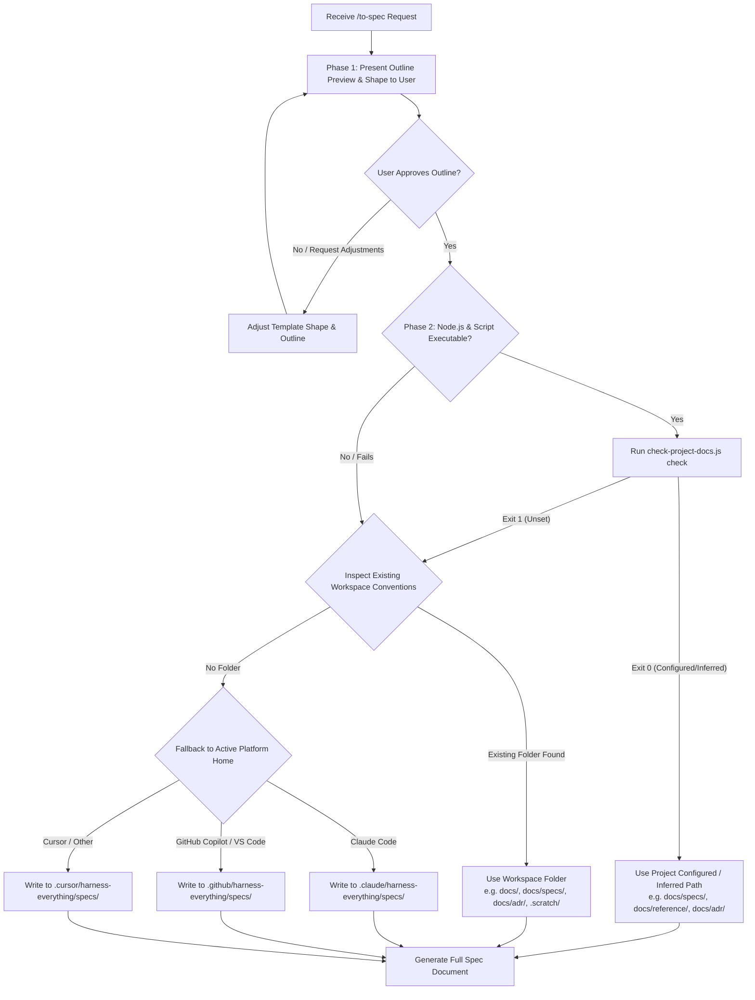

# To Spec — Full Process Reference

## Path Resolution Flow (Step 0)

## Evidence-Driven Context (Zero-Trust Boundaries) — full rules

When gathering context, you are strictly forbidden from "guessing" the architecture or existing behavior. Every finding MUST be backed by an explicit evidence chain presented in your thought process or chat output.

- **Format**: `Evidence: [File path & line number / Tool output] -> Finding: [What it means]`
- **Example**: `Evidence: read src/auth.ts line 45 -> Finding: The API currently lacks JWT token validation.`

Use the project's domain glossary vocabulary throughout, and respect any ADRs in the area you're touching. If `grill-with-docs` or `grill-me` ran earlier in this conversation, treat their resolved decisions (updated `CONTEXT.md` entries, new ADRs) as settled input — cite them, don't reopen them. For anything they didn't cover, synthesize from what's already been said rather than asking new questions. If a genuinely new, unresolved fork turns up that blocks writing the doc, that's a sign this conversation needed a grilling pass first — say so and suggest running `grill-me`/`grill-with-docs` before continuing, rather than interviewing ad hoc inside this skill.

## Template Selection — full guidance

| Shape | File | Fits when... |
| :--- | :--- | :--- |
| Feature spec (PRD) | [templates/feature-spec.md](../templates/feature-spec.md) | New user-facing feature/product surface with several implementation decisions — the thing that gets broken into tickets afterward (Tier 3, usually). |
| CLI / API reference | [templates/cli-reference.md](../templates/cli-reference.md) | A new or changed command, flag set, or single endpoint (Tier 2 or 3). |
| Schema / file format | [templates/schema-doc.md](../templates/schema-doc.md) | A data shape change — DB schema, config format, wire payload, on-disk state (Tier 2 or 3). |
| Dev / design doc | [templates/dev-doc.md](../templates/dev-doc.md) | A scoped technical decision worth recording that doesn't clear `grill-with-docs`'s bar for a full ADR (Tier 2, usually). |

Look at what's actually being built and choose the closest fit — don't default to the heaviest one out of habit.

## Interface Confirmation details

What "confirm" means depends on the shape picked:

- **Feature spec** → sketch the seams at which you'll test the feature. Prefer existing seams to new ones; use the highest seam possible; the ideal number is one. Check with the user that the seams match their expectations.
- **CLI/API reference or schema doc** → confirm the surface itself (the flag names, the field names/types) with the user before writing the full doc — that's the part expensive to change after the fact.
- **Dev doc / ADR** → confirm the decision statement in one line before expanding it into the full doc.

Skip this step only if the conversation already pinned down the relevant surface explicitly (e.g. a prior `grill-with-docs` pass already fixed the schema).

## Publishing details

Write the doc using the adapted template at the resolved storage path:

- **Feature spec** → files as a feature PRD or issue document:
  - Output path: `<resolved-path>/specs/<feature-slug>.md` or `<resolved-path>/<feature-slug>/spec.md`.
  - Apply status marker `Status: ready-for-agent`.
- **CLI/API reference, schema doc, dev doc / ADR** → standalone reference document:
  - Output path: `<resolved-path>/reference/<slug>.md` or `<resolved-path>/adr/<slug>.md`.

No additional triage needed beyond the `issueDefinition` marker. A clearly-shaped doc in the right place is what lets `to-tickets` cut clean vertical slices afterward instead of guessing at scope from a raw conversation transcript.

## Golden Flow rationale

After publishing a `Feature spec` (Tier 3), do NOT immediately instruct the user to run `/to-tickets`. Instead, instruct the user to initiate a Design Audit first: recommend invoking `multi-agent-workspace` (or manually starting parallel Sub-agents) to conduct a Fan-out architectural audit (e.g., Security Auditor, Senior Architect) on the newly published spec. State explicitly: "This specification must pass a Design Audit before being broken down by `/to-tickets`. Any architectural flaws or over-engineering must be caught now, not during implementation."
