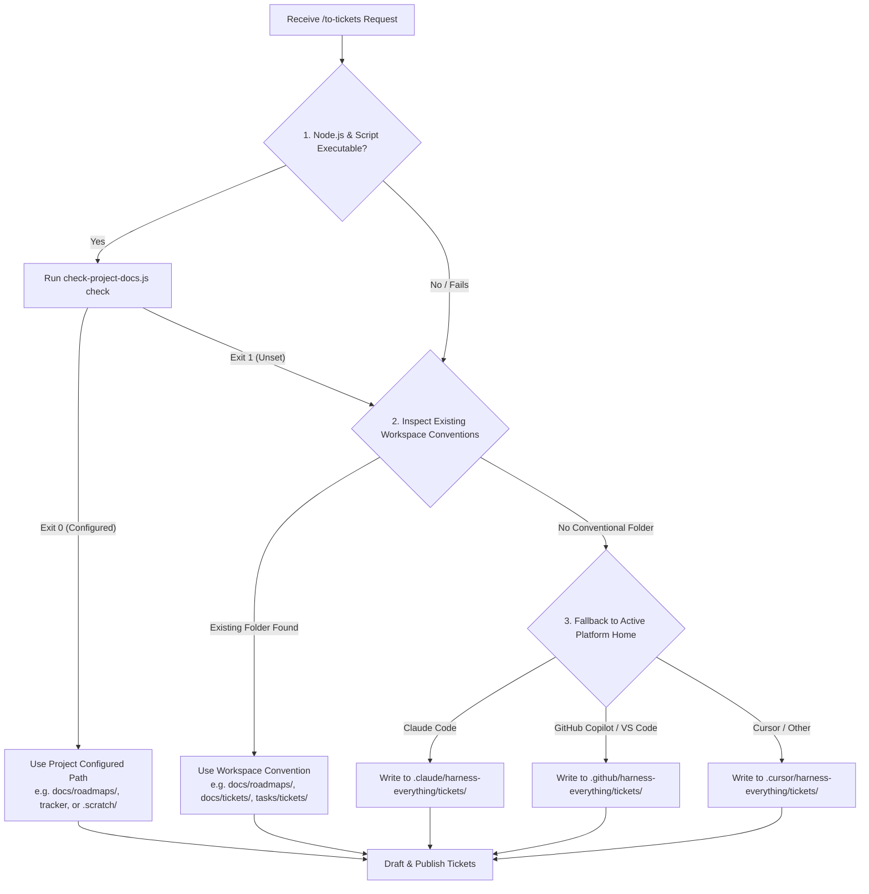

# Storage Path Resolution & Publishing Detail (moved from SKILL.md)

### 0. Resolve Storage Path & Framework (Gated Resolution Loop)

Follow the decision matrix below to determine where ticket artifacts must be published:

#### Path Resolution Rules:
1. **Explicit Project Configuration (`projectDocs`)**: If `check-project-docs.js` returns `Exit 0`, use the configured `docLocation` or `tracker`.
2. **Workspace Convention Inspection**: If unconfigured or script unavailable, check if any of these directories exist in the workspace:
   - `docs/roadmaps/`
   - `docs/tickets/`
   - `tasks/tickets/`
   - `.scratch/issues/`
   If found, save tickets in the matching directory.
3. **Platform Isolation Fallback**: If no directory convention exists, create and write ticket files inside the active IDE platform state folder:
   - Claude Code: `.claude/harness-everything/tickets/<NN>-<slug>.md`
   - GitHub Copilot: `.github/harness-everything/tickets/<NN>-<slug>.md`
   - Cursor: `.cursor/harness-everything/tickets/<NN>-<slug>.md`

# Wide Refactors: Expand-Contract Exception

Give each ticket its **blocking edges** — the other tickets that must complete before it can start. A ticket with no blockers can start immediately.

**Wide refactors are the exception to vertical slicing.** A **wide refactor** is one mechanical change — rename a column, retype a shared symbol — whose **blast radius** fans across the whole codebase, so a single edit breaks thousands of call sites at once and no vertical slice can land green. Don't force it into a tracer bullet; sequence it as **expand–contract**. First expand: add the new form beside the old so nothing breaks. Then migrate the call sites over in batches sized by blast radius (per package, per directory), each batch its own ticket blocked by the expand, keeping CI green batch to batch because the old form still exists. Finally contract: delete the old form once no caller remains, in a ticket blocked by every migrate batch. When even the batches can't stay green alone, keep the sequence but let them share an integration branch that all block a final integrate-and-verify ticket — green is promised only there.

# Contract lineage and change impact

When a ticket comes from an authoritative spec, it must carry the exact source requirement identity and revision. A ticket may refine implementation scope, but it never silently rewrites the approved contract.

Every ticket must classify its impact:

- **none** — bookkeeping/non-behavioral work; explain why no contract changes.
- **implementation** — implementation changes while approved behavior and architectural rationale stay unchanged.
- **behavior** — caller/user-visible behavior changes. Update the living spec requirement and revision first, then obtain requirement-linked RED evidence before accepting implementation.
- **architecture** — a hard-to-reverse decision/rationale changes. Publish a new/superseding ADR, update the living spec requirement/revision, then obtain RED evidence.

If the impact classification changes during implementation, stop treating the original ticket as completion authority. Reconcile the source artifacts first, then update the ticket's source revision.

# Ticket Templates

<local-ticket-template>

# <NN> — <Ticket title>

**What to build:** the end-to-end behaviour this ticket makes work, from the user's perspective — not a layer-by-layer implementation list.

**Blocked by:** the numbers/titles of the tickets that gate this one, or "None — can start immediately".

**Source requirements:** `REQ-001@rev1` (add every requirement this ticket changes or proves).

**Change impact:** `none | implementation | behavior | architecture`

**Impact rationale:** one sentence explaining why this classification is correct.

**Status:** ready-for-agent

- [ ] [REQ-001] Acceptance criterion 1
- [ ] Acceptance criterion 2

</local-ticket-template>

<issue-template>

## Parent

A reference to the parent issue/spec on the tracker (the `to-spec` feature spec this came from, if any — otherwise omit this section).

## What to build

The end-to-end behaviour this ticket makes work, from the user's perspective — not layer-by-layer implementation.

## Acceptance criteria

- [ ] Criterion 1
- [ ] Criterion 2

## Blocked by

- A reference to each blocking ticket, or "None — can start immediately".

</issue-template>

In either form, avoid specific file paths or code snippets — they go stale fast. Exception: if a prototype produced a snippet that encodes a decision more precisely than prose can (state machine, reducer, schema, type shape), inline it and note briefly that it came from a prototype. Trim to the decision-rich parts — not a working demo, just the important bits.

# Gather-Context Notes

If the referenced doc is a cli-reference, schema-doc, or dev-doc (a lighter to-spec shape, not a feature-spec), it is usually already ticket-sized on its own — confirm with the user whether it needs splitting before drafting.

# Evidence Format (Zero-Trust Exploration)

Every finding must cite explicit evidence: `Evidence: [File path & line number / Tool output] -> Finding: [What it means]`. Never guess codebase layout or dependencies.
