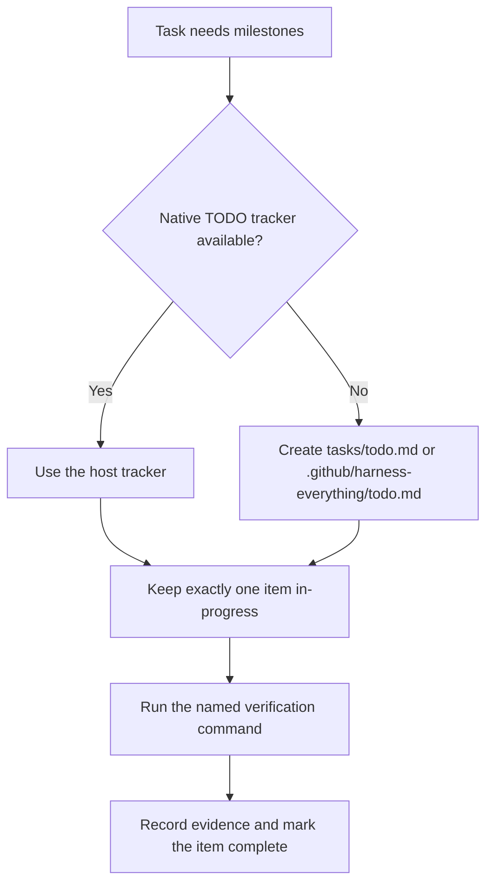

# Execution Guide (Deep Dive)

## Tracker selection

## Rules

1. Define 3-7 verifiable milestones before changing files.
2. Prefer the host's native TODO tool and preserve its status history.
3. If no native tracker exists, use a Markdown checklist in the repository or platform project-instructions area.
4. Each item names its output, pass condition, and verification command.
5. Keep one item `in-progress`; complete it from evidence before starting another.
6. When parallel agents are active, isolate their writes with `using-git-worktrees` and merge only after scope review.

The former repository TODO CLI is intentionally not a fallback. This keeps
tracking native to the host or transparent in Markdown and avoids shared
cross-session state collisions.
