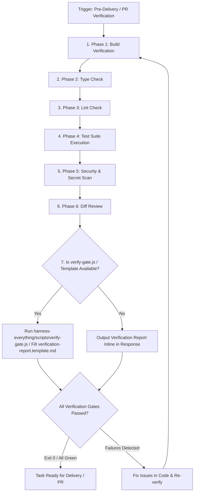

# Verification Phases (Deep Dive)

## Decision Flow



Adapt commands according to the project's ecosystem and active environment (`environment-detection`). Run commands directly without non-portable POSIX pipe assumptions (avoid raw `head`, `tail`, `grep`, `2>/dev/null` piping on Windows).

## Phase 1: Build Verification

```bash
# Check if project builds (JS/TS example)
npm run build
# OR
pnpm build
```

If build fails, STOP and fix before continuing.

## Phase 2: Type Check

```bash
# TypeScript projects
npx tsc --noEmit

# Python projects
pyright .
```

Report all type errors. Fix critical ones before continuing.

## Phase 3: Lint Check

```bash
# JavaScript/TypeScript
npm run lint

# Python
ruff check .
```

## Phase 4: Test Suite

```bash
# Run tests with coverage
npm run test -- --coverage

# Check coverage threshold
# Target: 80% minimum
```

Report:
- Total tests: X
- Passed: X
- Failed: X
- Coverage: X%

## Phase 5: Security & Code Hygiene Scan

Use native IDE search tools (`grep_search` / `file_search`) or cross-platform scripts rather than raw terminal `grep` pipes:
- Check for hardcoded API keys / secrets (`sk-`, `api_key`).
- Check for leftover debug log statements (`console.log`, `print`).

## Phase 6: Diff Review

```bash
# Show what changed
git diff --stat
git diff HEAD~1 --name-only
```

Review each changed file for:
- Unintended changes
- Missing error handling
- Potential edge cases

## Output Format

After running all phases, fill in `verification-loop/templates/verification-report.template.md` with the actual results and present it.

## Continuous Mode

For long sessions, run verification every 15 minutes or after major changes:

```markdown
Set a mental checkpoint:
- After completing each function
- After finishing a component
- Before moving to next task

Run: /verify
```

## Integration with Hooks

This skill complements PostToolUse hooks but provides deeper verification.
Hooks catch issues immediately; this skill provides comprehensive review.
