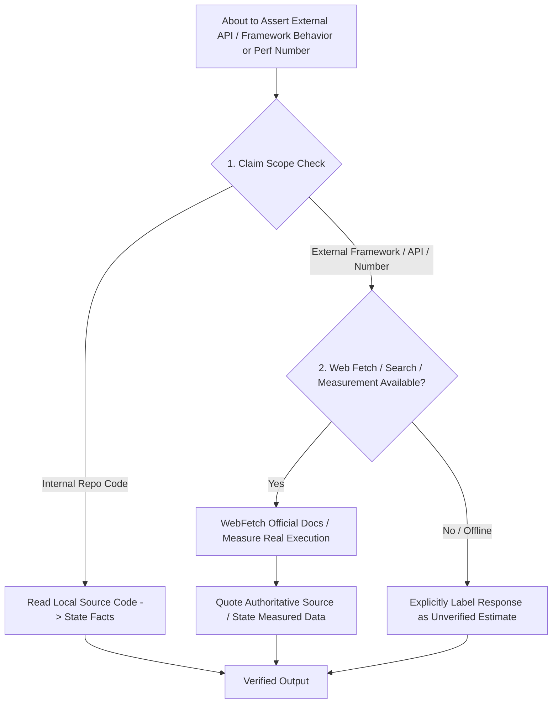

# Verification Guide — details moved from SKILL.md

## TRIGGER — verify before asserting, don't skip because the answer "feels obvious"

Whenever either is true:

1. **You are about to state how an external system currently behaves** —
   a framework, library, SDK, CLI tool, API, or service's schema, defaults,
   exit codes, config flags, pricing, rate limits, version-specific behavior,
   or "does X support Y." This includes cases that feel like common
   knowledge — exit-code conventions, hook payload shapes, and default
   values are exactly where confident misremembering happens.
2. **You are about to state a performance, cost, or timing number that
   wasn't produced by an actual run in this session** — "this should take
   ~X," "this is O(n)," "this will cost about $Y," "this should be fast
   enough." An estimate rendered with confidence is still an estimate.

## Procedure

- For claim (1): `WebFetch` the tool's official documentation first. If the
  official docs don't cover it, `WebSearch` and cite what you find. Quote the
  relevant part back rather than paraphrasing from memory — paraphrasing
  reintroduces the same risk you're trying to avoid.
- For claim (2): if the stakes justify it (the number feeds a design
  decision, a rejection/deferral, or something the user will act on),
  actually run it — a real benchmark, a real timing, a real measurement —
  instead of reasoning about what it "should" be. If running it isn't
  feasible, say explicitly that the number is an unverified estimate; don't
  present it with the same confidence as a measured fact.
- If a fetch or search comes back inconclusive or contradicts your prior
  assumption, say so and show the source — don't quietly reconcile it into
  something that sounds more confident than what you actually found.

## SKIP — don't over-trigger

- **The claim is about this repository's own code**, not an external system.
  Reading the actual source here already is the authoritative check; no web
  verification needed.
- **The user supplied the fact or number directly** in this conversation —
  trust their firsthand statement, don't second-guess it with a search.
- **Already verified this session** — don't re-fetch the same source
  redundantly if it was already checked earlier in this conversation and
  nothing suggests it changed.
- **Generic, non-version-specific CS/engineering knowledge** (what a hash map
  is, what Big-O notation means) — this isn't tied to any particular tool's
  current implementation, so there's nothing to go stale.

## Why this is a skill, not just a hook

The `tier-router.js` reminder is a keyword net — cheap, broad, and it can
only nudge, not judge whether a specific sentence you're about to write is
actually an unverified claim. The judgment call is still yours: notice when
you're about to assert something you haven't actually checked this session,
regardless of whether a keyword happened to fire.

## Decision matrix (reference)

