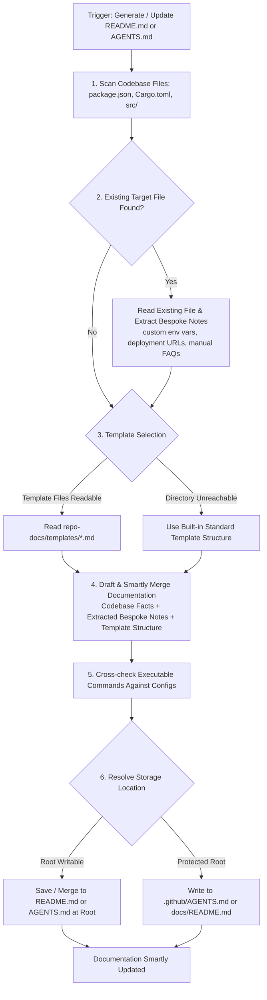

# Repo Docs (Automated Project Documentation Generation & Smart Merging)

## 📋 Skill Contract

| Component | Specification |
| :--- | :--- |
| **Trigger / Input** | Project lacks documentation, or user requests `README.md` / `AGENTS.md` / architectural guidelines update. |
| **Expected Output** | Reader-oriented `README.md` and/or agent-oriented `AGENTS.md`, smartly merging codebase scan facts with pre-existing bespoke notes. |
| **State Mutations** | Creates/updates `README.md`, `AGENTS.md`, or fallback state files. Preserves existing bespoke human documentation. |
| **Enforcement Gate** | **MUST** inspect existing doc files before writing. Extract and preserve bespoke manual notes (custom env vars, deployment URLs, legacy gotchas) while upgrading structure. |

## Process & Documentation Generation Flow

Follow the decision matrix below when generating or updating repository documentation:

## 1. Reconnaissance & Smart Preservation `[Discover]`
- **Fabrication Prohibited**: You absolutely MUST NOT rely on the model's historical training data to write documentation.
- **Smart Preservation & Merging (DO NOT Blindly Overwrite)**:
  - If a `README.md` or `AGENTS.md` already exists, use `read_file` to read it completely before making edits.
  - Extract bespoke human-written notes that cannot be inferred from code scans alone (e.g. proprietary deployment URLs, custom environment variables, historical architectural trade-offs, or legacy gotchas).
  - Blend these bespoke notes into the newly structured template layout.
- Call scripts or use `grep_search`, `read_file` to scan project directories and dependency files (`package.json`, `Cargo.toml`, `.env.example`, etc.).
- Confirm the project's real language, framework, test commands, and deployment methods. Codebase configs always serve as the Single Source of Truth over outdated prose in old README files.

## 2. Organization & Writing `[Think] & [Try]`
- **Reader-Oriented**: If generating a `README.md`, the content MUST focus on the "User Journey": what this product does, how to install it, how to use core features.
- If generating `AGENTS.md` or developer guidelines: The content MUST focus on "architectural conventions, build commands, test commands" for future AI Agents (or human developers) to read.
- **Combine with Cognitive Loop**: When writing, obey the `install-cognitive-os` rules, predict the chapter structure of the document first, generate it in one go, and leave room for future expansion.

## 3. Verification & Alignment `[Summarize]`
- After generating the document, you MUST ensure the installation or test commands within the document are **actually executable**.
- If there are uncertain parts, leave `// TODO: Pending confirmation` markers in the document and ask the human questions (`grill-me` mode).

## Deep Reference Templates
To ensure professional quality, you MUST use the appropriate template from `repo-docs/templates/`:
- `repo-docs/templates/readme-template.md` — Standard project documentation template
- `repo-docs/templates/product-readme-template.md` — Product archetype user-journey template
- `repo-docs/templates/multi-skills-readme-template.md` — Large project with multiple skills/modules
- `repo-docs/templates/single-skill-readme-template.md` — Single skill or focused utility documentation template
- `repo-docs/templates/knowledge-readme-template.md` — Information-heavy/knowledge-base template
- `repo-docs/templates/agents-template.md` — Standard agent onboarding instructions template
- `repo-docs/templates/product-agents-template.md` — Agent instructions for product repositories
- `repo-docs/templates/skills-agents-template.md` — Agent instructions for skills repositories
- `repo-docs/templates/knowledge-agents-template.md` — Agent instructions for knowledge/research projects
- `repo-docs/templates/manual-recon.md` — Methodology for manual repo scanning and classification
