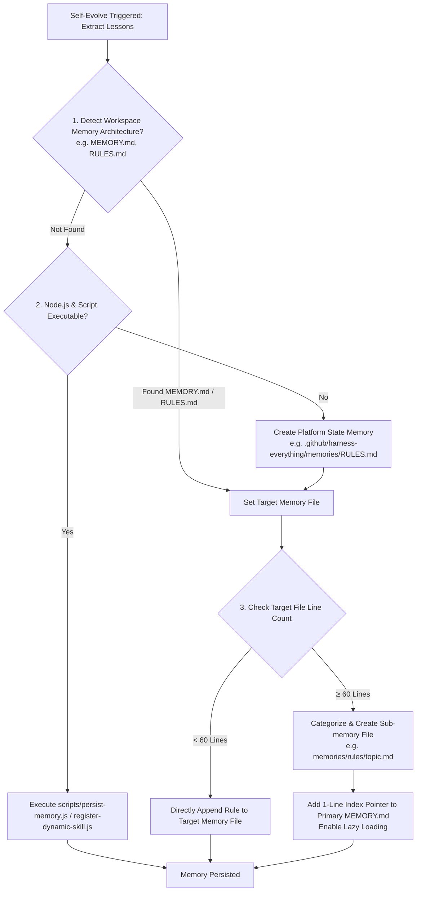

# Self Evolve (Self Evolution & Memory Extraction)

## 📋 Skill Contract

| Component | Specification |
| :--- | :--- |
| **Trigger / Input** | Task completion after a major struggle, or post-zoom-out recovery. Input: Root cause analysis of previous failure. |
| **Expected Output** | Persisted memory rule in workspace memory (`MEMORY.md`, `memories/repo/RULES.md`), CLI script execution, or modular sub-memory file. |
| **State Mutations** | Updates workspace memory files or platform state memory (`.github/harness-everything/memories/RULES.md`). |
| **Enforcement Gate** | Enforces the **60-Line Cleanliness Rule**: under 60 lines appends directly; 60+ lines creates a modular topic file with a 1-line index pointer for lazy loading. |

This skill enables long-term learning by extracting root causes from resolved challenges and recording defensive rules for future sessions.

## 1. Triggers
- **Post-Circuit Breaker**: Following successful recovery after a `zoom-out` reflection.
- **Major Breakthrough**: Upon completing complex tasks that revealed non-obvious framework limits or architectural edge cases.
- **Explicit Request**: When the user asks to "remember this lesson" or "save this to memory".

## 2. Execution Process & Memory Resolution Flow

Follow the decision matrix below to record extracted rules while maintaining memory cleanliness:

### Memory Resolution & Cleanliness Rules:

1. **Workspace Memory Inspection First**:
   Before creating new memory files or running scripts, check if the workspace already maintains a primary memory file (such as `MEMORY.md`, `memories/repo/RULES.md`, `CLAUDE.md`, or `AGENTS.md`). If found, prioritize updating the existing structure.

2. **The 60-Line Cleanliness & Lazy Loading Rule**:
   To prevent Context Bloat and keep workspace memory organized:
   - **Under 60 Lines**: Append the concise, generalized defensive rule directly to the primary memory file.
   - **60 Lines or Greater**:
     - **Modular Split**: Extract the rule into a dedicated topic file under a sub-folder (e.g. `memories/rules/db-migration.md` or `.github/harness-everything/memories/rules/<topic>.md`).
     - **Index Pointer & Lazy Loading**: Add a single-line link/pointer in the primary `MEMORY.md` (e.g. `- [DB Migration Rules](memories/rules/db-migration.md)`). Future agent sessions will lazy-load the sub-memory file only when touching that specific domain.

3. **Script Tooling Fallback**:
   If Node.js and `persist-memory.js` are executable, run `node "<this-skill-dir>/scripts/persist-memory.js" "<rule>"`. If script execution fails or is unavailable, use the agent's file tools or memory API directly.

## 3. Purpose
Through `self-evolve`, we transform "invalid trial-and-error", which might otherwise waste Tokens, into a valuable "moat" for the system. Even if the underlying model doesn't become inherently smarter, equipped with these memories, the system will automatically avoid known traps and break through its original reasoning ceiling.
