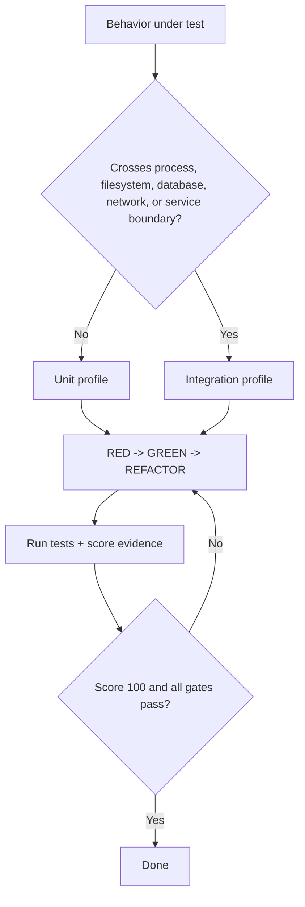

# Test-Driven Development

**ROUTER:** Select unit or integration evidence before RED/GREEN/REFACTOR.

## Skill Contract

| Component | Specification |
| :--- | :--- |
| **Trigger / Input** | Tier 2 feature, bugfix, or behavior-preserving refactor. |
| **Expected Output** | RED/GREEN logs and a profile-tagged quality report. |
| **State Mutations** | Tests, implementation, TODO state, and optional report JSON. |
| **Enforcement Gate** | Project tests plus `npm run tdd:quality -- <evidence.json>`; exit 1 blocks completion. |

## USE FOR:
- implementing behavior test-first
- bug regression tests
- safe refactors under tests

## DO NOT USE FOR:
- macro planning or scaffolding
- docs-only or non-testable work

## Route the Behavior

Read [core discipline](references/core-discipline.md) and the [common quality contract](references/quality-model.md), then load only [unit testing](references/unit-testing.md) or [integration testing](references/integration-testing.md). If a task needs both, record separate requirements; never merge their applicability rules.

After three failed GREEN attempts, invoke `zoom-out` before another edit.
