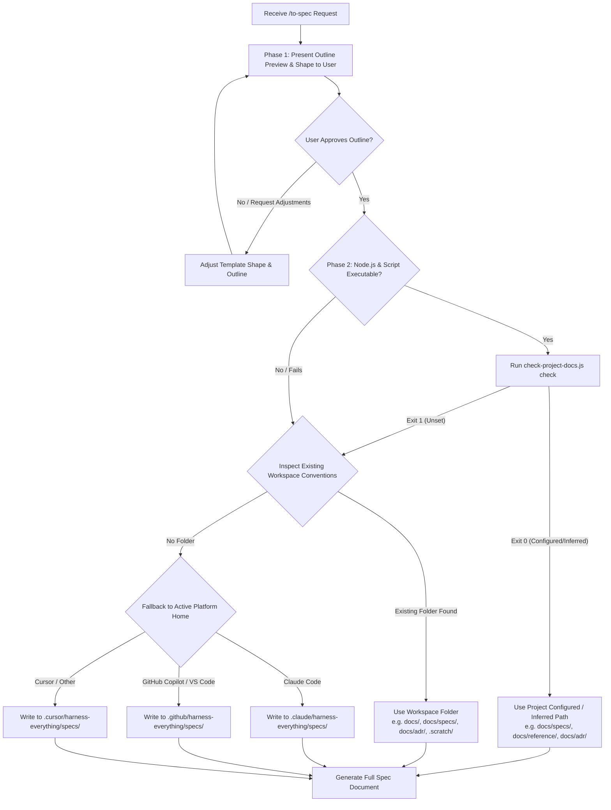

# To Spec

Synthesizes the current conversation and codebase understanding into a written artifact. Do **NOT** interview the user about the feature itself — that is `grill-me`/`grill-with-docs`'s job, run *before* this skill. The only interview this skill ever runs is the one-time Step 0 framework setup below, and only when the mechanized check says it's missing.

Not every task needs a PRD. This skill carries four starting skeletons under `templates/` and picks (or blends) the one that matches what's actually being built, so the same skill covers a macro feature, a new CLI flag, a schema change, or a small design decision — without forcing a heavyweight document on a lightweight task.

## 📋 Skill Contract

| Component | Specification |
| :--- | :--- |
| **Trigger / Input** | Explicit `/to-spec` invocation (never auto-run — publishing has a real side effect). Input: the current conversation plus whatever `CONTEXT.md`/ADRs/grilling already settled. |
| **Expected Output** | One published doc using whichever `templates/*.md` skeleton fits the artifact (PRD, CLI Reference, Schema Doc, Dev Doc / ADR) — placed per the repo's `projectDocs` entry, detected convention, or platform fallback. |
| **State Mutations** | Reads/writes `projectDocs` in `manifest.json` via script if available. Writes the specification doc/issue at the resolved location. |
| **Enforcement Gate** | **Outline Confirmation Gate**: MUST present a concise template outline and target location preview to the user before writing the full document. Run `check-project-docs.js check` if available; fallback gracefully without halting or forcing interviews on Exit 1. |

## Process

### 0. Resolve Storage Path & Framework (Gated Resolution Loop)

Follow the decision matrix below to determine where specification artifacts must be published:



#### Path Resolution Rules:
1. **Explicit / Inferred Project Configuration (`projectDocs`)**: If `check-project-docs.js` returns `Exit 0`, use the configured or inferred `docLocation` (e.g., `docs/specs/`, `docs/reference/`, `docs/adr/`).
2. **Workspace Convention Inspection**: If unconfigured or script unavailable, check if any of these directories exist in the workspace:
   - `docs/specs/`
   - `docs/reference/`
   - `docs/adr/`
   - `docs/`
   - `.scratch/`
   If found, save specs in the matching directory.
3. **Platform Isolation Fallback**: If no directory convention exists, create and write spec files inside the active IDE platform state folder:
   - Claude Code: `.claude/harness-everything/specs/<slug>.md`
   - GitHub Copilot: `.github/harness-everything/specs/<slug>.md`
   - Cursor: `.cursor/harness-everything/specs/<slug>.md`

### 1. Gather context

Explore the repo to understand the current state of the codebase, if you haven't already. Use the project's domain glossary vocabulary throughout, and respect any ADRs in the area you're touching.

If `grill-with-docs` or `grill-me` ran earlier in this conversation, treat their resolved decisions (updated `CONTEXT.md` entries, new ADRs) as settled input — cite them, don't reopen them. For anything they didn't cover, synthesize from what's already been said rather than asking new questions. If a genuinely new, unresolved fork turns up that blocks writing the doc, that's a sign this conversation needed a grilling pass first — say so and suggest running `grill-me`/`grill-with-docs` before continuing, rather than interviewing ad hoc inside this skill.

### 2. Pick template shape & present outline preview

Look at what's actually being built and choose the closest fit — don't default to the heaviest one out of habit:

| Shape | File | Fits when... |
| :--- | :--- | :--- |
| Feature spec (PRD) | [templates/feature-spec.md](templates/feature-spec.md) | New user-facing feature/product surface with several implementation decisions — the thing that gets broken into tickets afterward (Tier 3, usually). |
| CLI / API reference | [templates/cli-reference.md](templates/cli-reference.md) | A new or changed command, flag set, or single endpoint (Tier 2 or 3). |
| Schema / file format | [templates/schema-doc.md](templates/schema-doc.md) | A data shape change — DB schema, config format, wire payload, on-disk state (Tier 2 or 3). |
| Dev / design doc | [templates/dev-doc.md](templates/dev-doc.md) | A scoped technical decision worth recording that doesn't clear `grill-with-docs`'s bar for a full ADR (Tier 2, usually). |

#### MANDATORY: Outline Preview Confirmation
Before writing any file to disk, present a 10-20 line outline preview to the user:

```markdown
I will generate a **[Shape Name]** document based on our conversation with the following outline:
- [Section 1: Objective / Key Goals]
- [Section 2: Command Flags / Interface / Schema Structure]
- [Section 3: Testing Strategy & Success Criteria]

Target Output Path: `<resolved-path>/<slug>.md`
Should I proceed with generating the full document?
```

Only proceed to write the full document after the user confirms or provides adjustments.

### 3. Confirm the interface before publishing

What "confirm" means depends on the shape picked in Step 2:

- **Feature spec** → sketch the seams at which you'll test the feature. Prefer existing seams to new ones; use the highest seam possible; the ideal number is one. Check with the user that the seams match their expectations.
- **CLI/API reference or schema doc** → confirm the surface itself (the flag names, the field names/types) with the user before writing the full doc — that's the part expensive to change after the fact.
- **Dev doc / ADR** → confirm the decision statement in one line before expanding it into the full doc.

Skip this step only if the conversation already pinned down the relevant surface explicitly (e.g. a prior `grill-with-docs` pass already fixed the schema).

### 4. Write and publish

Write the doc using the adapted template at the resolved storage path (from Step 0):

- **Feature spec** → files as a feature PRD or issue document:
  - Output path: `<resolved-path>/specs/<feature-slug>.md` or `<resolved-path>/<feature-slug>/spec.md`.
  - Apply status marker `Status: ready-for-agent`.
- **CLI/API reference, schema doc, dev doc / ADR** → standalone reference document:
  - Output path: `<resolved-path>/reference/<slug>.md` or `<resolved-path>/adr/<slug>.md`.

No additional triage needed beyond the `issueDefinition` marker. A clearly-shaped doc in the right place is what lets `to-tickets` cut clean vertical slices afterward instead of guessing at scope from a raw conversation transcript.
