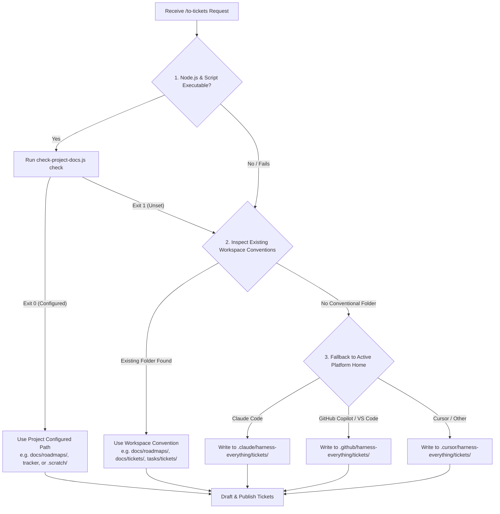

# To Tickets

Breaks a plan, a `to-spec`-produced feature spec, or the current conversation into **tickets** — tracer-bullet vertical slices, each declaring the tickets that **block** it.

## 📋 Skill Contract

| Component | Specification |
| :--- | :--- |
| **Trigger / Input** | Explicit `/to-tickets` invocation (never auto-run — publishing has a real side effect). Input: a reference to a `to-spec` feature spec (path/issue number/URL) if one exists, otherwise whatever plan/conversation is already in context. |
| **Expected Output** | A numbered set of tickets, each with a "What to build" description, a "Blocked by" list, and acceptance criteria — published per this repo's `projectDocs` entry, detected convention, or platform fallback. |
| **State Mutations** | None to `manifest.json` itself — this skill only *reads* `projectDocs` if present. Writes the ticket files/issues at the resolved location. |
| **Enforcement Gate** | Run `node "to-spec/scripts/check-project-docs.js" check` if available. Never block or fail on Exit 1; fallback seamlessly to workspace inspection and platform-specific fallback directories. MUST present the proposed breakdown to the user and get approval before publishing (Step 4). |

## Process

### 0. Resolve Storage Path & Framework (Gated Resolution Loop)

Follow the decision matrix below to determine where ticket artifacts must be published:

#### Path Resolution Rules:
1. **Explicit Project Configuration (`projectDocs`)**: If `check-project-docs.js` returns `Exit 0`, use the configured `docLocation` or `tracker`.
2. **Workspace Convention Inspection**: If unconfigured or script unavailable, check if any of these directories exist in the workspace:
   - `docs/roadmaps/`
   - `docs/tickets/`
   - `tasks/tickets/`
   - `.scratch/issues/`
   If found, save tickets in the matching directory.
3. **Platform Isolation Fallback**: If no directory convention exists, create and write ticket files inside the active IDE platform state folder:
   - Claude Code: `.claude/harness-everything/tickets/<NN>-<slug>.md`
   - GitHub Copilot: `.github/harness-everything/tickets/<NN>-<slug>.md`
   - Cursor: `.cursor/harness-everything/tickets/<NN>-<slug>.md`

### 1. Gather context

Work from whatever is already in context, in priority order:

1. **A `to-spec` feature spec**, if the user passes a reference (issue number, URL, or `.scratch/<slug>/spec.md` path) or one was published earlier in this conversation — fetch it and read the full body (and comments, if a real tracker). This is the preferred source: it already went through seam-confirmation and cites settled `CONTEXT.md`/ADR decisions, so the ticket breakdown inherits a clean document trail instead of being re-derived from a raw transcript.
2. Otherwise, work from whatever plan or conversation is already in context — same as before, no spec is not a blocker.

If the referenced doc is a `cli-reference`, `schema-doc`, or `dev-doc` (one of `to-spec`'s lighter shapes, not a `feature-spec`), it's usually already ticket-sized on its own — don't force a multi-ticket vertical-slice breakdown onto something that's really one unit of work. Confirm with the user whether it needs splitting at all before running Step 3.

### 2. Explore the codebase (optional)

If you have not already explored the codebase, do so to understand the current state of the code. Ticket titles and descriptions should use the project's domain glossary vocabulary, and respect ADRs in the area you're touching.

Look for opportunities to prefactor the code to make the implementation easier. "Make the change easy, then make the easy change."

### 3. Draft vertical slices

Break the work into **tracer bullet** tickets.

<vertical-slice-rules>

- Each slice cuts a narrow but COMPLETE path through every layer (schema, API, UI, tests) — vertical, NOT a horizontal slice of one layer
- A completed slice is demoable or verifiable on its own
- Each slice is sized to fit in a single fresh context window
- Any prefactoring should be done first

</vertical-slice-rules>

Give each ticket its **blocking edges** — the other tickets that must complete before it can start. A ticket with no blockers can start immediately.

**Wide refactors are the exception to vertical slicing.** A **wide refactor** is one mechanical change — rename a column, retype a shared symbol — whose **blast radius** fans across the whole codebase, so a single edit breaks thousands of call sites at once and no vertical slice can land green. Don't force it into a tracer bullet; sequence it as **expand–contract**. First expand: add the new form beside the old so nothing breaks. Then migrate the call sites over in batches sized by blast radius (per package, per directory), each batch its own ticket blocked by the expand, keeping CI green batch to batch because the old form still exists. Finally contract: delete the old form once no caller remains, in a ticket blocked by every migrate batch. When even the batches can't stay green alone, keep the sequence but let them share an integration branch that all block a final integrate-and-verify ticket — green is promised only there.

### 4. Quiz the user

Present the proposed breakdown as a numbered list. For each ticket, show:

- **Title**: short descriptive name
- **Blocked by**: which other tickets (if any) must complete first
- **What it delivers**: the end-to-end behaviour this ticket makes work

Ask the user:

- Does the granularity feel right? (too coarse / too fine)
- Are the blocking edges correct — does each ticket only depend on tickets that genuinely gate it?
- Should any tickets be merged or split further?

Iterate until the user approves the breakdown.

### 5. Publish the tickets

Publish the approved tickets at the resolved storage path (from Step 0):

- **Local File Storage** (Markdown files):
  - Write one file per ticket under `<resolved-path>/<NN>-<slug>.md` (e.g. `docs/roadmaps/01-setup.md` or `.github/harness-everything/tickets/01-setup.md`).
  - Number tickets from `01` in dependency order (blockers first). Each file's "Blocked by" lists the numbers/titles it depends on. Use the per-ticket file template below — one ticket per file, never a single combined file.
- **A Real Issue Tracker** (GitHub, GitLab, Jira, etc.):
  - Publish one issue per ticket in dependency order (blockers first) so each ticket's blocking edges can reference real identifiers. Use the platform's native blocking / sub-issue relationship where available.
  - Apply status marker `Status: ready-for-agent`.

Work the **frontier**: any ticket whose blockers are all done. For a purely linear chain that means top to bottom.

Do NOT close or modify any parent issue.

<local-ticket-template>

# <NN> — <Ticket title>

**What to build:** the end-to-end behaviour this ticket makes work, from the user's perspective — not a layer-by-layer implementation list.

**Blocked by:** the numbers/titles of the tickets that gate this one, or "None — can start immediately".

**Status:** ready-for-agent

- [ ] Acceptance criterion 1
- [ ] Acceptance criterion 2

</local-ticket-template>

<issue-template>

## Parent

A reference to the parent issue/spec on the tracker (the `to-spec` feature spec this came from, if any — otherwise omit this section).

## What to build

The end-to-end behaviour this ticket makes work, from the user's perspective — not layer-by-layer implementation.

## Acceptance criteria

- [ ] Criterion 1
- [ ] Criterion 2

## Blocked by

- A reference to each blocking ticket, or "None — can start immediately".

</issue-template>

In either form, avoid specific file paths or code snippets — they go stale fast. Exception: if a prototype produced a snippet that encodes a decision more precisely than prose can (state machine, reducer, schema, type shape), inline it and note briefly that it came from a prototype. Trim to the decision-rich parts — not a working demo, just the important bits.
