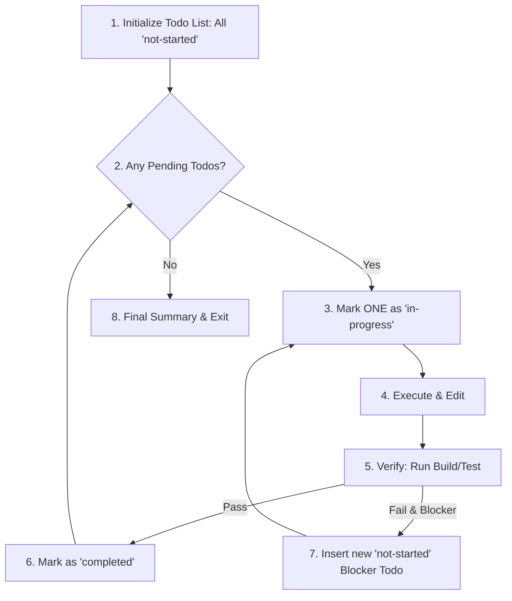

# Todo-Driven Workflow (以 TODO 驅動的自動化工作流)

This skill enforces a disciplined execution loop. It prevents "hallucinated progress" and "compliance theater" by forcing the Agent to break down complex tasks, track exact state, and prove completion before moving to the next step. 

---

## ⚡ Core Trigger (觸發時機)
This workflow is **the default operating behavior** for any complex, multi-step, or multi-file development tasks. You MUST initiate this workflow whenever:
- The `harness-everything` router classifies the task as **Tier 2 or Tier 3** — this skill is the harness's base execution loop for those tiers (Tier 1 trivial tasks are exempt).
- Tackling multi-file refactoring, deep architectural changes, or untangling technical debt.
- Implementing features that require multiple sequential validations (e.g., compile -> test -> fix).
- Specifically requested by the user, or when starting any task in a workspace with this skill installed.

## 🧭 Position in the Harness (與其他 skills 的關係)
- **Upstream**: `harness-everything` triages the tier and loads this skill; `install-cognitive-os` supplies the cognitive loop (Discover > Think > Try > Summarize > Record) that each todo item executes at task granularity.
- **Sideways**: In Tier 2 the checklist items map onto `tdd`'s Red/Green/Refactor phases; in Tier 3, `fable-mode`'s macro plan IS the checklist, and sub-agent handoffs are tracked as items.
- **Downstream**: The Verify step (§3 of the loop) uses `verification-loop` as the pre-delivery gate. If the same blocker item fails 3 times, trigger the `zoom-out` circuit breaker instead of retrying. After a hard-won completion, feed insights to `self-evolve`.

---

## ⚙️ Platform-Specific Adaptability (跨平台與工具鏈適配)

Because different environments provide different task-tracking capabilities, the "Todo List" must be mapped dynamically to the best tool available:

| Environment | Primary Task Tracker | Implementation Method |
| :--- | :--- | :--- |
| **VS Code Copilot Chat** | `manage_todo_list` | Call the native `manage_todo_list` tool on state transitions. |
| **Claude Code** | `TodoWrite` (native tool) | Call the native `TodoWrite` tool on every state transition. Do NOT hand-write `.harness/handoff-state.json` — that WAL is maintained automatically by the `state-persist.js` PostToolUse hook. |
| **Cursor / Windsurf** | Markdown Checked Checklists | Prepend/append the active `[ ]` checklist in the Chat panel or write to a temporary `.harness/TODO.md` file. |
| **Multi-Agent Flow** | `memory-keeper` or Shared JSON | Write to the shared state space to coordinate across subagent boundaries. |

---

## 🔄 Execution Loop: Think > Try > Summarize > Record

No matter what tool is used for tracking, the execution loop is **deterministic** and consists of the following phases:

### 1. Analyze and Plan (Think)
Before taking any action or modifying any code, analyze the requirements. Break the high-level goal into **3 to 7 concrete, verifiable sub-tasks**.
- *Rule*: Each task must have a clear "definition of done" (e.g., "Write test case for X", "Implement API endpoint", "Verify compiler output").

### 2. Initialize the Todo List (Record)
Initialize the list using the designated tracker. All tasks MUST start as `not-started`.
- *Rule*: Do NOT start actual coding or heavy file reading until the list is initialized and presented to the user.

### 3. Step-by-Step Execution
For each task in the list, strictly follow this execution loop:
1. **Start**: Mark the target task as `in-progress`. **Only ONE task can be in-progress at a time.**
2. **Execute**: Perform the necessary actions (read files, grep, run terminal commands, edit files).
3. **Verify (Law of Evidence Assertion)**: Run compilers, tests, or linters to gather real execution evidence. You MUST NOT assume success.
4. **Complete**: Once verified, update the list to mark the task as `completed`. Do not batch status updates (e.g., updating `in-progress` and `completed` in the same turn).

### 4. Handling Blocker Failures (Dynamic Adaptation)
If a step fails or uncovers a deeper dependency error:
- Do NOT silently ignore or bypass the error.
- Insert a new, highly specific `not-started` task at the front of the queue to address the blocker (e.g., "Resolve TS2307 compilation error in model layer").
- Adjust the execution path dynamically, keeping the blocker task as `in-progress` until resolved.

---

## 🛑 Critical Pitfalls (避免之紅線)
- ❌ **Compliance Theater**: Updating tasks to completed without actually running verification commands.
- ❌ **Ghost Tasks**: Performing major edits or running commands that do not map to any active task on the list. If you find yourself drifting, stop, update the checklist first, and resume.
- ❌ **Task Bloat**: Creating more than 10 tasks at once. Keep the checklist lean, focused, and bite-sized.
