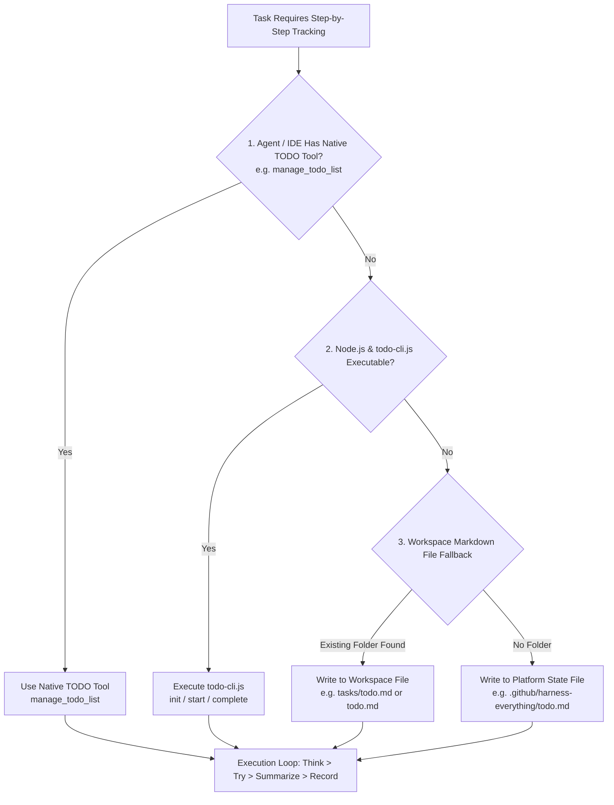

# Todo-Driven Workflow

## 📋 Skill Contract

| Component | Specification |
| :--- | :--- |
| **Trigger / Input** | Tier 2/3 task identification. Input: High-level task description. |
| **Expected Output** | Step-by-step state tracking via native tool, CLI script, or workspace markdown state file. |
| **State Mutations** | Updates native TODO tool state, `.claude/harness-state/todo-state.json`, or workspace file (`tasks/todo.md`). |
| **Enforcement Gate** | Focuses on exactly ONE active `in-progress` task at a time to maintain clean context boundaries. |

This skill structures execution into deliberate, single-task milestones to prevent context drift and maintain clear progress visibility.

---

## ⚡ Core Trigger
Recommended for complex, multi-step, or multi-file development tasks (Tier 2 and Tier 3).

## ⚙️ Execution Method & Tool Selection Matrix

Follow the decision matrix below to determine the task tracking method:

```mermaid
flowchart TD
    Start[Task Requires Step-by-Step Tracking] --> CheckNativeTool{1. Agent / IDE Has Native TODO Tool?<br>e.g. manage_todo_list}
    
    CheckNativeTool -- Yes --> UseNative[Use Native TODO Tool<br>manage_todo_list]
    CheckNativeTool -- No --> CheckScript{2. Node.js & todo-cli.js Executable?}
    
    CheckScript -- Yes --> UseScript[Execute todo-cli.js<br>init / start / complete]
    CheckScript -- No --> FileFallback{3. Workspace Markdown File Fallback}
    
    FileFallback -- Existing Folder Found --> PathRepo[Write to Workspace File<br>e.g. tasks/todo.md or todo.md]
    FileFallback -- No Folder --> PathPlatform[Write to Platform State File<br>e.g. .github/harness-everything/todo.md]
    
    UseNative --> Loop[Execution Loop: Think > Try > Summarize > Record]
    UseScript --> Loop
    PathRepo --> Loop
    PathPlatform --> Loop
```

#### Execution Rules:
1. **Native IDE/Agent Tool Priority**: If the environment provides a native TODO management tool (such as `manage_todo_list`), **MUST** use it as the primary tracker. Maintain exactly 1 item `in-progress` at a time and mark completed immediately.
2. **CLI Script Fallback**: If no native tool exists but Node.js & `todo-cli.js` are executable, run `node "<this-skill-dir>/scripts/todo-cli.js"`.
3. **Workspace Markdown File Fallback**: If neither tool nor script is available, create and update a markdown checklist file in the workspace (`tasks/todo.md`, `todo.md`, or `.github/harness-everything/todo.md`).

### 🔀 Multi-Agent Concurrency & Isolation
When running multiple Sub-agents in parallel (e.g. during `fable-mode` tasks), avoid concurrent state modifications in a single workspace folder. Leverage `using-git-worktrees` to isolate each parallel agent into its own git worktree for clean filesystem-level separation.

---

## 🔄 Execution Loop: Think > Try > Summarize > Record

### 1. Analyze and Plan (Think)
**Intent Precedence**: State your high-level goal upfront (e.g. `[Scope Discovery]`, `[TDD Feature Implementation]`). Break the requirement into 3 to 7 concrete, verifiable sub-tasks.

### 2. Initialize the Todo List (Record)
Initialize the checklist before modifying code:
`node "<this-skill-dir>/scripts/todo-cli.js" init "Task 1" "Task 2"`

### 3. Step-by-Step Execution
1. **Start Task**: Run `node "<this-skill-dir>/scripts/todo-cli.js" start <id>` to mark the active item.
2. **Execute**: Perform necessary changes (read files, run commands, edit code).
3. **Verify**: Verify changes using test/build tooling.
4. **Complete Task**: Run `node "<this-skill-dir>/scripts/todo-cli.js" complete <id>` after verification succeeds.

### 4. Adapting to Issues
If unexpected blockers arise during execution, append sub-tasks using:
`node "<this-skill-dir>/scripts/todo-cli.js" add "Fix specific error"`
