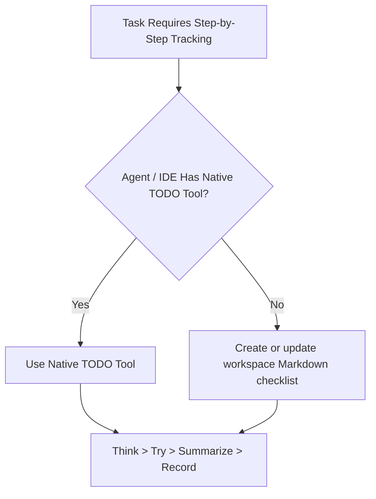

# Execution Guide (Deep Dive)

## Tool Selection Matrix

## Execution Rules

1. If the environment provides a native TODO tool such as `manage_todo_list`,
   use it as the primary tracker. Keep exactly one item in progress.
2. Otherwise create or update a workspace checklist such as `tasks/todo.md`,
   `todo.md`, or `.github/harness-everything/todo.md`.
3. Keep the checklist short: 3-7 verifiable items for a multi-step task.
4. Mark an item complete only after the real verification command passes.

## Multi-Agent Concurrency & Isolation

When multiple sub-agents work in parallel, use `using-git-worktrees` so each
agent has a separate filesystem and checklist.

## Execution Loop

### Think

State the goal and split it into bounded, verifiable sub-tasks.

### Record

Initialize the native checklist, or write markdown checklist items before
modifying code.

### Try and Verify

Mark one item in progress, execute the work, and run the relevant test or
verification gate.

### Summarize

Record actual command output and blockers. Add a concrete follow-up item when
the diagnosis changes; do not create a second tracker.
