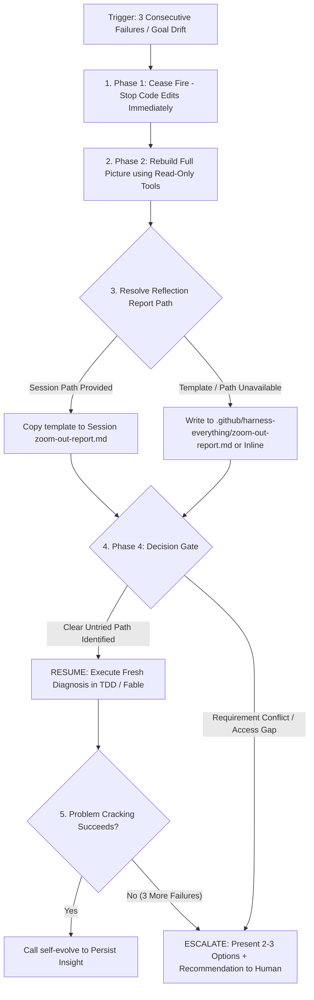

# Zoom Out (Global Perspective & Circuit Breaker)

## 📋 Skill Contract

| Component | Specification |
| :--- | :--- |
| **Trigger / Input** | Terminal script failures 3 times in a row, divergence, or explicit "step back" request. Input: Error logs. |
| **Expected Output** | Reflection report written to disk or presented inline, followed by self-recovery or human decision escalation. |
| **State Mutations** | Writes `zoom-out-report.md` at session path, `.github/harness-everything/zoom-out-report.md`, or inline. |
| **Enforcement Gate** | Pause code edits immediately upon 3 failures. Must write reflection report before resuming edits. |

## Process & Circuit Breaker Resolution Flow

Follow the decision matrix below when hitting a circuit breaker:

## 1. Triggers
- **Rule of 3 (Repeated Failures)**: Attempting to fix the same error or test failure 3 times without progress.
- **Divergence**: Fixing one bug repeatedly introduces new secondary errors.
- **Goal Drift**: Execution strays far from the initial task objective.
- **User Instruction**: The user requests a step back ("zoom out", "step back", "stop and think").

## 2. Phase 1 — Cease Fire
- Pause code editing attempts immediately.
- Refrain from guessing quick fixes without checking underlying facts first.

## 3. Phase 2 — Rebuild Full Picture (Reflect & Fact-Check)
Use read-only tools (Read / Grep / Glob) to gather fresh evidence:
1. **Restate Goal**: Review original objectives from task/todo context.
2. **Examine Failed Attempts**: Identify the underlying belief behind each failed fix.
3. **Fact-Check Assumptions**: Verify files, configuration, logs, and docs directly.
4. **Elevate Perspective**: Check for layer mismatches, API contract misunderstandings, or conflicting requirements.
5. **Form Fresh Diagnosis**: Synthesize a comprehensive explanation that accounts for all observed evidence.

## 4. Phase 3 — Write Reflection Report
Copy `zoom-out/templates/zoom-out-report.template.md` to the `zoom-out-report.md` path given in the Rule of 3 message and fill it in section by section.

A complete report automatically releases the circuit breaker on hook-enabled systems.

## 5. Phase 4 — Decision Gate: Resume or Escalate

- **RESUME**: Selected when the fresh diagnosis identifies a clear, untried path within existing authority.
- **ESCALATE**: Reserved for true decision points belonging to the user (conflicting requirements, destructive migration, missing credentials/access, or repeated breaker trips).
Hand the human a **decision**, not a plea:

> "Goal: [...]. I falsified paths X, Y, Z — verified facts: [...].
> The real blocker is a [requirement conflict / architecture trade-off / destructive step / access gap], which is your call, not mine.
> Option A: [...] (trade-off: ...). Option B: [...] (trade-off: ...).
> I recommend A because [...]. Which direction do you choose?"

Banned: "I have tried everything and failed, please help." That reports incapability, not a decision.

## 7. Recovery
- **Self-recovery path**: a valid report ending in `RESUME` releases the breaker — reload the appropriate execution mode (`tdd`, `fable-mode`) and execute the new diagnosis. If the SAME failure signature accumulates 3 more failures, the breaker hard-locks and the decision goes to the human.
- **Human path**: after the human answers an `ESCALATE`, or clears a hard lock (`npm run harness:reset` in their own terminal, or a new session / `/clear`), continue under their direction.
- Either way, once the problem is ultimately cracked, feed the insight to `self-evolve`.
